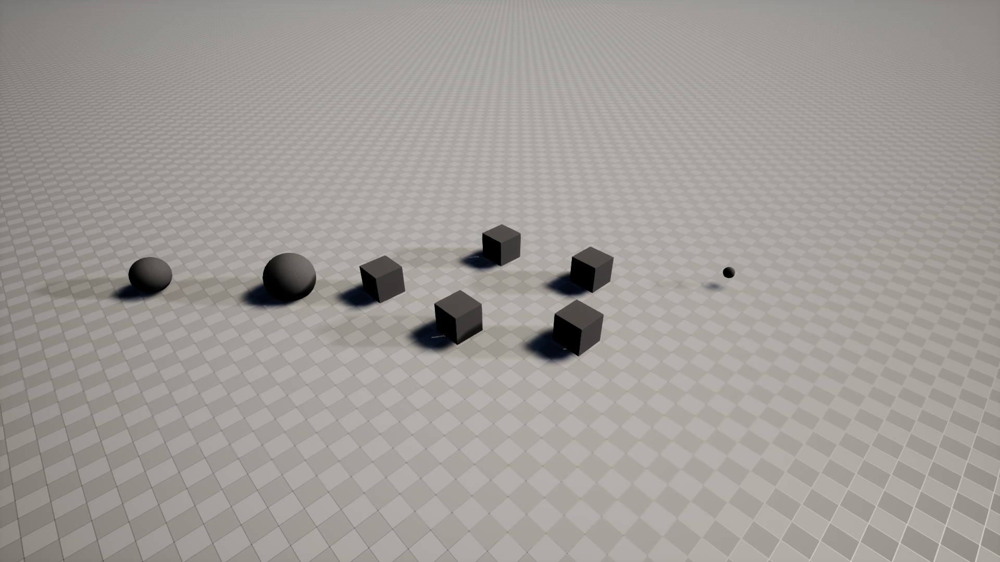

This repository contains a Safe Reinforcement Learning (Safe RL) implementation using Probability Shields in a 3D navigation environment. The agent is trained using Proximal Policy Optimization (PPO) to navigate safely while avoiding hazards.

📖 Project Overview

In many RL environments, an agent may encounter unsafe states that can lead to failures or hazards. Probability Shields act as a safety layer, modifying or overriding unsafe actions in real-time to prevent collisions or unsafe behavior.

This project demonstrates:

A 3D Safe RL environment using PyBullet and Gymnasium.
Implementation of a SafetyShield wrapper to enforce safety constraints.
Training an RL agent using Stable Baselines3 PPO.
Collection of metrics including rewards, interventions, and safety violations.
Visualization of agent performance and safety compliance.

🛠 Features

Custom 3D navigation environment (SafeNav3DEnv)
Hazard generation with curriculum learning
Safety interventions via Probability Shields (SafetyShield)
Metrics collection (MetricsCallback) for rewards, costs, and interventions
Training with Stable Baselines3 PPO
Visualization of rewards, crashes, and interventions
3D demo of the trained agent

💻 Installation

Clone the repository and install dependencies:

git clone https://github.com/nitinn889/SafeRL.git


Dependencies:

Python >= 3.8
gymnasium
pybullet
numpy
torch
stable-baselines3
matplotlib
seaborn

⚙️ Usage

As of Phase 2 the code lives in the `saferl/` package (see the Phase 2
section below) instead of a single script. Install dependencies, then:

1. Train the agent
```
pip install -r requirements.txt
python -m saferl.training.train
```
This trains the PPO agent in the SafeNav3DEnv with safety interventions,
using `saferl/configs/default.yaml` for all hyperparameters. Metrics such
as rewards, cumulative crashes, and interventions are collected, and the
trained model is saved to `saferl_model.zip`.

2. Visualize training results
Graphs for rewards, total crashes, and interventions are saved to
`saferl_metrics.png` automatically at the end of training.

3. Run 3D demonstration
```
python -m saferl.demo.run_demo
```
Launches a PyBullet GUI showing the trained agent (loaded from
`saferl_model.zip`) navigating the environment while avoiding hazards.

4. Run tests
```
pytest tests/
```

📊 Results

After training, you can visualize:

Episode Rewards: Agent performance per episode.
Cumulative Crashes: Number of unsafe collisions over time.
Interventions: Number of times the Probability Shield intervened to prevent unsafe actions

🔬 References
Stable Baselines3 Documentation
PyBullet Documentation
Safe Reinforcement Learning with Probability Shields: Relevant research papers

⚡ Notes
Training time may vary depending on GPU/CPU.
Adjust total_timesteps in the training script to control training duration.
Safety interventions ensure the agent avoids hazards but may limit exploration initially.

---

## Phase 2 (2026-09-11): UE viability spike + repo restructure

### Goal A: UE Python-API viability spike -- executed, result inconclusive, my recommendation is the fallback

The drive holding UE 5.8 (`/dev/nvme0n1p3`, `/mnt/bigdata`) got mounted and
the spike ran for real. Full writeup with both measurements and the
reasoning: [`ue_spike/README.md`](ue_spike/README.md). Short version:

- **Commandlet-mode measurement (real, but not the number that matters):**
  `./ue_spike/run_spike.sh` ran 500 `reset()`/`step()` calls against a
  placeholder actor through UE's in-process Editor Python API (chosen
  over an external-process + Remote Execution setup -- fewer moving parts)
  headless via `UnrealEditor-Cmd -run=pythonscript -nullrhi -unattended`.
  Stable across two runs, no crash: **~179,000-181,000 "steps"/sec**. But
  this is a single Python script executing with no running frame loop at
  all between calls -- it's the floor cost of a Python-to-C++ property
  accessor call, not a per-simulated-frame rate. It was never going to be
  the bottleneck, and isn't informative for training-speed purposes on
  its own.
- **Tick-driven measurement (blocked):** tried to get a number bound by a
  real running engine loop by registering a per-tick callback and driving
  one step per actual engine tick, launched as a persistent (non-
  commandlet) process. Tried 4 ways (`UnrealEditor-Cmd`/`UnrealEditor` x
  with/without `-unattended`); all four self-terminated within 1-2 ticks
  regardless of the registered callback -- a bare `-nullrhi` editor with
  no PIE/game session apparently has nothing it considers worth staying
  alive for. That's a real finding: sustaining a persistent headless
  training loop needs a running PIE/`-game` session, not just a Python
  callback -- more infrastructure than this spike's scope.
- **Arithmetic:** `saferl/configs/default.yaml` trains for
  `timesteps: 30000`. At the (not representative) 180k/s call-overhead
  number that's ~0.17s; at a genuine physics-tick rate it could be
  anywhere from a few seconds to tens of minutes depending on whether
  headless UE throttles ticks toward real-time (30-120fps) or runs much
  faster unthrottled with nothing to render -- a spread wide enough that
  guessing isn't useful, and PPO here will likely want well beyond 30k
  steps once the shield/reward move past placeholders, widening the gap
  further.
- **For comparison, a known quantity:** this session's PyBullet regression
  check (below) trained the full 30k-timestep run in ~28s at ~1090 fps,
  headless, no extra infrastructure.

**My recommendation** (yours to accept or override, not decided
unilaterally): default to the fallback -- train in the existing PyBullet
env, use UE only for rendering/demo playback of a trained policy. That
needs no new engineering (`saferl/demo/run_demo.py` already renders via a
GUI env; swapping renderers later is a smaller lift than making UE the
live training loop now). If you'd rather pursue direct-UE training, the
concrete next step is a follow-up spike measuring step rate inside an
actual running PIE/`-game` session -- say so and that's the next thing to
build, not this fallback.

### Goal B: Repo restructure -- done

`2.py` (used as source of truth over the near-duplicate `Saferl.py`, which
is now removed) has been split into a package:
```
saferl/
  env/base_env.py        SafeNav3DEnv (PyBullet)
  shield/safety_shield.py SafetyShield, ShieldedEnv
  training/train.py       training entrypoint (python -m saferl.training.train)
  training/metrics.py     MetricsCallback
  configs/default.yaml    all hyperparameters (size, max_hazards, force_mag,
                           SAFE_DIST, TIMESTEPS, etc. -- no more magic numbers in code)
  demo/run_demo.py        visual demo entrypoint, loads a saved model
tests/test_env.py         reset/step shape checks + shield intervention tests
```
`2.py`'s three bugfixes are preserved as-is: obs tracked in `ShieldedEnv`
(not re-fetched from the base env), `make_env` is a factory function (not
a lambda), and the cost accumulator resets on episode boundaries in
`MetricsCallback`.

Two behavioral changes from splitting one script into a package: `train.py`
now saves the trained model to `saferl_model.zip` (so `run_demo.py` can
load it independently -- the original script kept `model` in memory and
ran the demo in the same process), and `SafetyShield.safe_dist` /
`force_mag` moved from hardcoded class attributes to constructor params
read from `configs/default.yaml`. No env physics, reward shaping, or shield
logic changed.

**Regression check, run this session:** `python -m saferl.training.train`
with the default config (30,000 timesteps, PyBullet DIRECT mode) completed
in ~28s at ~1090 fps, trained without errors, and saved a model. Both the
restructured version and the original untouched `2.py` produce **0
completed episodes** in that run and therefore no metrics plot -- verified
identical on both, so this is not a regression, but a pre-existing
characteristic worth flagging: the env has no episode step cap
(no `TimeLimit`), and with `SAFE_DIST=2.2` vs. `hazard_threshold=1.3` the
shield tends to steer the agent away before a hazard collision can ever
set `done=True`, while reaching the goal under an early-training policy is
rare enough that a single episode can run past 30k steps without
terminating either way. Worth deciding in Phase 3: add a max-episode-step
limit, or otherwise loosen why episodes rarely end.

`tests/test_env.py` (5 tests: obs shape on reset, step doesn't crash across
all 4 actions, shield intervenes near a hazard, shield leaves a clear-path
action alone, `ShieldedEnv` tracks `_last_obs` without reaching back into
the base env) all pass.

### Open questions / deferred decisions

1. **UE go/no-go** -- measured, but inconclusive (see Goal A above): the
   number obtained isn't the one that determines training speed, and my
   recommended fallback (PyBullet-primary, UE-for-rendering) is a
   recommendation, not a decision made for you. Confirm or override it,
   and say if you want the PIE-based follow-up spike instead.
2. **Episodes essentially never terminate** in the current env/shield
   combination (see regression check above) -- not fixed this phase since
   phase 2 scope explicitly excludes redesigning env/shield logic, but
   Phase 3's shield redesign should account for it.
3. Local-only files `SafeRL_SpaceDebris_Project.md` and
   `saferl_debris_capture/` (present in the working directory from Phase 1
   but never pushed) were left untouched and uncommitted -- out of scope
   for this phase's changes; tell me if you want them added.

### What Phase 3 should assume

- `saferl/` is the source of truth; `2.py`/`Saferl.py` are gone (still in
  git history if needed).
- The PyBullet env (`saferl/env/base_env.py`) trains and passes tests, but
  produces no completed episodes at the current 30k-timestep default --
  don't treat "0 episodes" test output as a new bug introduced by whatever
  Phase 3 changes; it predates this restructure.
- The current `SafetyShield` is still the phase-1 placeholder (random
  action near a hazard) -- real shield logic is explicitly Phase 3/5 scope.
- Default to PyBullet as the training env (this session's recommendation
  pending your sign-off, see Goal A above) with UE reserved for rendering.
  Direct-UE training is not ruled out, but treat it as unvalidated until a
  PIE-based follow-up spike measures real physics-tick throughput -- the
  measurement taken this phase was call-overhead only, not representative
  of training speed.

---

## Phase 3 (2026-09-11): UE Editor + PIE live, episode-termination fix, untracked files landed

### Goal A: UE Editor + PIE running with the environment visible -- achieved

The full Unreal Editor GUI comes up (Vulkan, real rendering -- not headless,
not `-nullrhi`, not a commandlet), spawns the satellite, five debris cubes,
a goal marker and a light, starts a real Play-In-Editor session, and drives
the phase 2 `reset()`/`step()` loop against the PIE-world actor.

Run it with:
```bash
SAFERL_RUN_PIE=1 /mnt/bigdata/unreal_engine/Engine/Binaries/Linux/UnrealEditor \
    ue_spike/SafeRLUESpike.uproject -nosound -log
```
`init_unreal.py` picks up `SAFERL_RUN_PIE=1` and arms
[`ue_spike/Content/Python/pie_session.py`](ue_spike/Content/Python/pie_session.py).
Launched natively, not through Docker -- the engine on `/mnt/bigdata` runs
directly and no container was needed.

**Measured tick-bound rate: ~119 steps/sec** (500 steps in 4.20s;
reproduced at 118.4 / 119.1 / 119.0 across three runs, recorded in
[`ue_spike/pie_session_results.json`](ue_spike/pie_session_results.json)).
The session stayed alive well past the 500-step requirement, and the loop
exercised `reset()` too: the satellite reached the goal and reset 3 times
during the run. This is the number phase 2 could not get -- one env step
per rendered engine frame, capped by the actual frame rate.

Visual record, rendered by the engine itself during the live session:

([`pie_session_midrun.png`](ue_spike/pie_session_midrun.png),
[`pie_session_final.png`](ue_spike/pie_session_final.png)) -- the large
sphere is the goal marker, the smaller sphere the satellite mid-traverse,
and the five cubes are the debris field. These are `SceneCapture2D` renders
rather than desktop screenshots: this host is Wayland, and X11 screen grabs
of the editor window come back solid black.

**Does this change the phase 2 recommendation? No -- it confirms it, and now
on real evidence rather than a guess.** At 119 steps/sec:

| | 30k steps (current default) | 1M steps |
|---|---|---|
| UE live PIE | ~4.2 min | ~2.3 hours |
| PyBullet (measured, phase 2 + re-run this phase) ~1090/s | ~28 sec | ~15 min |

UE is ~9x slower, which is survivable for a 30k demo run but not for the
step budgets a real safe-RL curriculum wants. So: **keep training in
PyBullet, use UE for rendering and demo playback** -- same recommendation
as phase 2, now measured rather than assumed. Two caveats worth your
judgement before treating 119/s as a hard ceiling: it is one env step per
*rendered* frame, so uncapping the frame rate, running several env steps
per tick, or suppressing rendering during training could each raise it;
and this is still kinematic actor movement, not UE rigid-body physics
under load. **Confirm or override this and I will follow it** -- I have not
changed direction on my own.

Phase 2 got one conclusion wrong and this phase corrects it: the editor
self-terminating after 1-2 ticks had nothing to do with `-nullrhi` "having
nothing to keep it alive". It is `-ExecutePythonScript`, which quits the
editor as soon as the script returns -- it does exactly the same thing in a
full GUI session. Arming from `init_unreal.py` instead keeps the session
alive indefinitely.

Other things worth knowing about running UE this way on this host:
- PIE hangs during audio device init (SDL/pulseaudio); `-nosound` avoids it.
- A `SceneCapture2D` holding a 1920x1080 target re-renders the scene every
  frame and drags the loop from ~119 to ~6 steps/sec. Screenshots are taken
  after the timed run, never during it.
- UE's log buffering stalls under load and makes a perfectly healthy run
  look hung. The session mirrors progress to `ue_spike/pie_heartbeat.log`
  (gitignored) so you can watch it from outside the engine.

### Goal B: episode-termination bug root-caused and fixed

**Root cause was the physics, not the wrappers.** The termination checks in
`env/base_env.py` were correct and nothing was dropping `done` in
`ShieldedEnv` or `Monitor`. The agent simply could not move:
`sphere2.urdf` loads at **10kg with lateralFriction 0.5**, so once it
settles onto the ground plane it sits behind **~49N of static friction**
while the 4-action set can only produce **12N** of thrust. Measured
directly: under constant thrust the agent travels 0.03 units, and its
velocity is then exactly 0.000 for the rest of the run. Neither the goal
check (12.7 units away) nor the collision check could ever fire -- on any
physics backend.

Compounding it, `applyExternalForce` only persists for a single substep, so
one env step held thrust for 1/240s -- about 0.005 m/s of delta-v.

Fixed at the root, both in the env and both config-driven:
- `agent_friction` (default `0.0`) -- a satellite has no ground to rub
  against; the ground plane is an artifact of the toy env.
- `sim_substeps` (default `10`) -- hold thrust across substeps, decoupling
  the ~24Hz control rate from PyBullet's 240Hz physics rate.

`max_episode_steps` (default `1000`) was added **as well**, not instead:
it returns `truncated=True`, never `done=True`, so a wandering policy gets
an episode boundary while genuine goal/collision termination stays
distinguishable from it.

New regression tests in `tests/test_env.py`, all passing (9 total):
- `test_goal_reached_terminates` -- teleport onto the goal, assert `done`
- `test_hazard_collision_terminates` -- teleport onto a hazard, assert
  `done` and `cost == 1`
- `test_agent_actually_moves` -- sustained thrust must displace the agent
  (the direct guard against the friction lock recurring)
- `test_truncation_fires_without_terminating`

**Training regression re-run** (30k timesteps, PyBullet, default config):
**34 completed episodes** and the metrics plot generated, against **0
episodes and no plot** before the fix. `ep_len_mean` settles around 900,
i.e. most episodes still end at the truncation cap rather than on the goal
-- expected for an untrained policy over 30k steps with the shield
deflecting it away from hazards, and worth revisiting when the real shield
lands.

### Goal C: untracked files landed, unmodified

Both were added exactly as they were, at their existing top-level paths,
with no edits and nothing folded into `saferl/`. At a glance:

- **`SafeRL_SpaceDebris_Project.md`** -- 41KB / 1128-line research and
  development plan: "Probabilistic Shield-Augmented Reinforcement Learning
  for Autonomous Capture of Tumbling Space Debris". Abstract, MDP
  formulation, probabilistic shielding theory, tumbling dynamics, and a
  6-phase 9-12 month timeline. Written around **NVIDIA Isaac Lab**.
- **`saferl_debris_capture/`** -- 540KB, 26 tracked files, an 18-module
  Python package scaffold: `envs/` (Isaac Lab env, 36-D obs / 6-D action,
  Euler-equation tumbling dynamics, reward shaping), `shield/` (a **PRISM**
  DTMC model plus abstraction/query/wrapper), `agents/` (PPO, SAC,
  shielded), `training/`, `evaluation/`, `tests/`, and a `docs/paper_draft.md`.
  `__pycache__` excluded by the existing root `.gitignore`.

Flagging without acting on it: both describe a **different simulation stack
(Isaac Lab + PRISM) than the UE + PyBullet line this repo has followed**,
and that `shield/` scaffold is a real probabilistic shield, which is what
phases 3/5 of the current track were meant to build. That is a direction
question for you, not something this phase resolved.

### Open questions / deferred decisions

1. **UE tick-rate recommendation** -- 119 steps/sec confirms PyBullet-for-
   training / UE-for-rendering, but the ceiling may be soft (see caveats
   above). Confirm, or tell me to chase a higher number.
2. **Two parallel project definitions** -- the newly landed Isaac Lab +
   PRISM plan versus this repo's UE + PyBullet track. Which is the real
   roadmap? This affects everything from phase 4 onward.
3. **The shield is still the phase-1 placeholder** (random action near a
   hazard). Untouched this phase, as scoped.
4. Most episodes still end by truncation rather than by reaching the goal
   (`ep_len_mean` ~900 of 1000). Fine for now; revisit with the real shield.

### What Phase 4 (dynamic debris field) should assume

- Episodes genuinely terminate. `done` fires on goal and on collision,
  `truncated` fires at `max_episode_steps`, and there are tests holding
  each of those in place.
- The env is frictionless with a 10-substep control step. Any new dynamics
  work should keep thrust meaningful relative to mass -- the friction-lock
  failure mode is easy to reintroduce and silent when it happens.
- A live UE PIE session is a solved, repeatable path (`SAFERL_RUN_PIE=1`,
  `-nosound`, arm from `init_unreal.py`, never `-ExecutePythonScript`), at
  ~119 steps/sec, driving actors kinematically from Python.
- Training still runs in PyBullet. Do not move training into UE on the
  strength of this phase alone -- open question 1.
- The debris field is static in both backends. The UE scene uses five
  hardcoded debris positions in `pie_session.py`; the PyBullet env still
  randomizes hazard positions per episode with curriculum scaling.

---

## Phase 4 (2026-09-11): Dynamic debris field + UE throughput experiment

### Goal A: dynamic debris field

**Motion model.** Each hazard is assigned a random heading and a speed drawn
from `[debris_min_speed, debris_max_speed]` (default `0.3` - `1.2` env
units/sec) at spawn, then drifts linearly. Position advances by
`velocity * step_dt` each `step()`, where `step_dt = sim_substeps / 240Hz`
(0.0417s with the current config) so debris motion shares the agent's
control timescale rather than running on an unrelated clock. Hazard bodies
are set to **mass 0 and driven kinematically** — otherwise gravity drops
them and contact impulses knock them off their assigned trajectories.

**Boundary behaviour: reflection (bounce).** Debris reflect off the edges of
the `[0, size]` play area, with both position mirrored and velocity
negated. Reasons for picking this over the alternatives: it keeps the debris
count and therefore the observation layout constant (wrapping and
despawn/respawn both do too, but), and unlike wrapping it never teleports an
object across the field into the agent's path. A wrapped object appearing
adjacent to the agent produces an unavoidable collision — no policy and no
shield could have prevented it — which would inject noise into exactly the
safety signal phase 5's shield has to learn from. Despawn/respawn has the
same problem plus a spawn-placement rule to get wrong.

**Observation space: 24 → 39.** Each hazard block is now `[pos(3), vel(3)]`
instead of `[pos(3)]`, so the policy can see motion instead of inferring it.
`OBS_HEADER_LEN` (9) and `OBS_PER_HAZARD` (6) are exported from
`saferl/env/base_env.py` so the layout has exactly one definition;
`SafetyShield` imports them rather than hardcoding a stride. The shield's
*logic* is untouched — still a position-only distance check that picks a
random action — only its indexing moved onto the new stride. Relative
velocity / time-to-collision reasoning is phase 5's job.

**Collision check uses live positions.** `_advance_hazards()` runs before
both `_get_obs()` and the collision check, so both read this step's state.
This is covered by a test that parks a hazard on the agent mid-episode and
asserts the next step terminates — it fails if either path ever goes back to
reading a reset-time snapshot.

**Curriculum on debris speed: implemented, not deferred.** Matching the
existing hazard-count ramp, when `curriculum` is on the *upper* speed bound
ramps from `debris_min_speed` to `debris_max_speed` over
`debris_speed_ramp_episodes` (default 200). Early episodes face near-static
debris; later ones face the full speed band. The lower bound stays fixed so
there is always some motion to react to.

**Tests: 8 new, 17 total, all passing.** Debris actually move between steps
(catches "velocity stored but never applied"), obs tracks live debris
position and velocity, the collision check uses current positions, boundary
reflection keeps every hazard inside the play area across 200 steps, obs
shape matches the new size, PPO builds and predicts against the widened obs
without crashing, and both curriculum speed paths.

**Training regression:** 30k timesteps, no crash, **30 completed episodes**
and the metrics plot written (phase 3's fixed baseline was 34). As expected,
nobody is dodging anything yet — sampling a random policy over 40 episodes
gives 1 goal / 4 crashes / 35 truncations at ~907 mean episode length.
Moving debris does produce real collisions now, which static debris plus the
deflecting shield largely prevented.

### Goal A: shield-relevant content extracted from the Isaac Lab / PRISM files

Read from `saferl_debris_capture/shield/` and `SafeRL_SpaceDebris_Project.md`
directly rather than from phase 3's one-line summary. The stack (Isaac Lab)
is dead per your call, but the **shield design is stack-independent** and
phase 5 should start from it rather than from scratch. What is actually
specified there:

**1. Three-stage architecture.** `abstraction.py` → `shield_query.py` →
`shield_wrapper.py`: map the continuous observation into a small discrete
state, look up a model-checked probability for each (state, action), and
allow-or-override at runtime. Each stage is independently replaceable.

**2. Abstract state `(d, f, t)` — 45 states.** Distance bucket `d ∈ 0..4`
(0 = contact, 4 = far), contact-force bucket `f ∈ 0..2` (0 = safe,
2 = overload), tumble-rate bucket `t ∈ 0..2`. **Translation needed for this
repo:** `f` (contact force) and `t` (tumbling) don't exist in the navigation
task. The natural analogues are distance-to-nearest-debris and a
**closing-rate / time-to-collision bucket** — which is precisely what the
debris velocity added in this phase now makes computable.

**3. Conservative abstraction rule.** When a continuous value sits near a
bucket boundary, round toward the **more dangerous** bucket, so the shield is
never over-optimistic. Cheap to implement, and worth carrying over verbatim.

**4. Safety spec in PCTL, quantitative and checkable:**
`P<=0.05 [ F<=20 "collision" ]` (collision probability within 20 steps ≤ 5%)
and `P>=0.90 [ F<=50 "captured" ]` (task success within 50 steps ≥ 90%).
Having a written, falsifiable spec is the part the current placeholder
shield most obviously lacks.

**5. Override rule: least-restrictive safe action.** If
`P(collision | state, action) > threshold` (default 0.05), substitute the
action that minimises collision probability **while still making progress** —
explicitly not a random action. This is the single biggest delta from this
repo's current shield, which picks uniformly at random from all four
directions and can therefore steer *into* a hazard.

**6. Offline table vs online PRISM.** The design precomputes a
`(num_states, num_actions)` probability table offline and loads it as a
numpy array — zero subprocess overhead per step. Online PRISM invocation is
~100ms/call, which it flags as offline-analysis-only. At ~1090 steps/sec in
PyBullet, anything but a table lookup is a non-starter in the training loop.

**7. Transition probabilities calibrated from rollouts**, not hand-waved:
the `.pm` file's constants are annotated as estimated from offline rollouts
of the dynamics model, with a `shield/estimate_transitions.py` step in the
plan to produce them.

**8. Structured intervention logging** — each intervention records state,
proposed action, substituted action, collision probability and threshold.
This repo currently keeps only an integer counter.

**9. References the design cites:** Jansen et al., *Safe Reinforcement
Learning Using Probabilistic Shields* (CONCUR 2020); Hasanbeig et al.,
*Cautious Reinforcement Learning with Logical Constraints* (AAMAS 2020).

Nothing from these files was implemented this phase, per scope.

### Goal B: UE throughput experiment

Same 500-step protocol as phase 3, four configurations. `pie_session.py`
gained `SAFERL_UNCAP`, `SAFERL_STEPS_PER_TICK` and `SAFERL_RESULTS_NAME`;
defaults reproduce the phase 3 protocol exactly.

| configuration | steps/sec | world ticks for 500 steps | world ticks/sec |
|---|---|---|---|
| capped + throttled, 1 step/tick | 4.2 | 500 | 4.2 |
| **uncapped, 1 step/tick** | **119.0** | 500 | **119.0** |
| uncapped, 10 steps/tick | 1117.3 | 50 | 111.7 |
| uncapped, 50 steps/tick | 4426.3 | 10 | 88.5 |
| *(PyBullet, for reference)* | *~1090* | — | — |

**Two findings, and the second is the one that matters.**

First, phase 3's 119/s was measured with the editor window focused.
Unfocused, the editor throttles to **4.2 steps/sec**. `Slate.AllowThrottling 0`
(alongside `t.MaxFPS 0` and `r.VSync 0`) makes 119/s reproducible regardless
of focus. So 119 was a real number, but it needs those CVars to be dependable
— use `SAFERL_UNCAP=1` for any future measurement.

Second: **the frame-rate ceiling is not soft, and batching does not lift it.**
Look at the last column — world ticks/sec stays flat at 88-119 across every
configuration. Stepping 10 or 50 times per rendered frame does not make UE
simulate faster; it performs more Python-side transform writes *between* the
same ~119 frames. Those extra steps advance no UE physics at all, which is
exactly the caveat that made phase 2's 180,000/s number meaningless.

So: if an env step has to advance UE's own physics — the entire premise of
using UE as the simulator rather than a renderer — **~119 steps/sec is the
real ceiling**, roughly 9x slower than PyBullet, the same ratio phase 3
reported. **The phase 2/3 recommendation stands: train in PyBullet, use UE
for rendering and demo playback.** I did not change the backend, and there is
no new evidence here that would justify revisiting it. Per the time-box, I
stopped after one clean measurement set rather than chasing exotic tuning.

### Open questions / deferred decisions

1. **Debris speed band** (`0.3` - `1.2` env units/sec) was chosen to be
   visibly dynamic without being unavoidable, not calibrated against
   anything physical. If you want Kuiper-belt-realistic relative velocities,
   that is a modelling decision worth making deliberately in phase 5 or 6.
2. **Debris motion is linear, not orbital.** No gravity wells, no relative
   orbital mechanics, and debris pass through each other. Fine for a
   reaction-to-motion task; flagged in case the realism matters later.
3. **The reward is unchanged** and still gives no credit for near-miss
   avoidance, so with moving debris the agent is scored almost entirely on
   goal-reaching and crashes. Worth revisiting alongside the shield.
4. **Untouched from phase 3:** the shield is still the random-action
   placeholder, and the action space is still `Discrete(4)`.

### What Phase 5 (shield redesign) should assume

- **Debris move, and the observation carries their velocity.** Obs is 39-wide
  for `max_hazards=5`: `[agent_pos(3), agent_vel(3), goal_pos(3)]` then
  `[pos(3), vel(3)]` per hazard. Use `OBS_HEADER_LEN` / `OBS_PER_HAZARD` from
  `saferl.env.base_env` rather than hardcoding offsets — changing the layout
  again means changing them in one place.
- **Closing rate is now computable** from the observation, so a
  time-to-collision shield is buildable without touching the env.
- **The shield redesign has a prior design to start from**, summarised above:
  conservative abstraction, a PCTL safety spec, a precomputed probability
  table, and least-restrictive-safe-action overrides instead of random ones.
  The random-action placeholder is actively harmful with moving debris — it
  can steer into a hazard — so replacing the override rule is the highest-value
  single change.
- **Training stays in PyBullet** (~1090 steps/sec), measured again this phase.
  UE remains rendering/demo only, at a confirmed ~119 steps/sec ceiling.
- **Any UE session needs `SAFERL_UNCAP=1`** to avoid the 4.2/s background
  throttle, plus `-nosound` and arming via `init_unreal.py`.
- Episode termination, the friction fix and the truncation backstop from
  phase 3 are all intact and covered by tests (17 passing).
