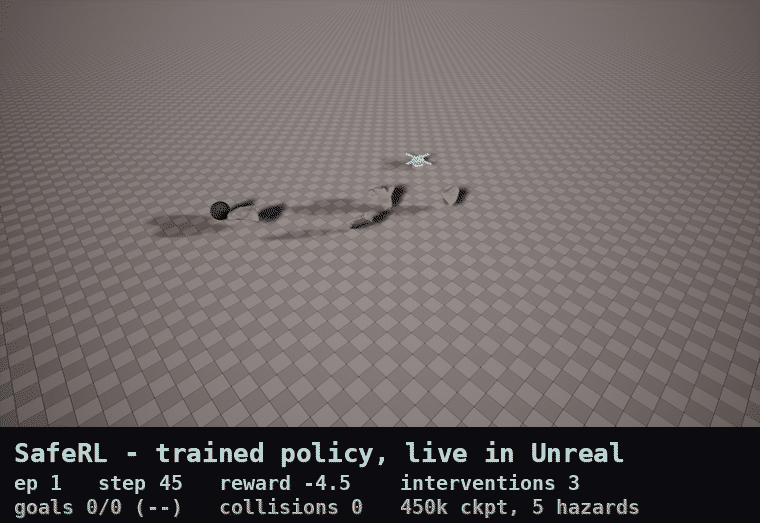
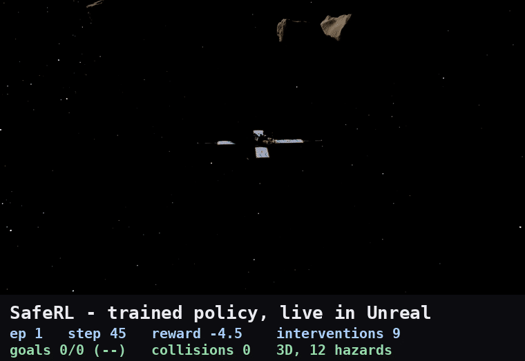
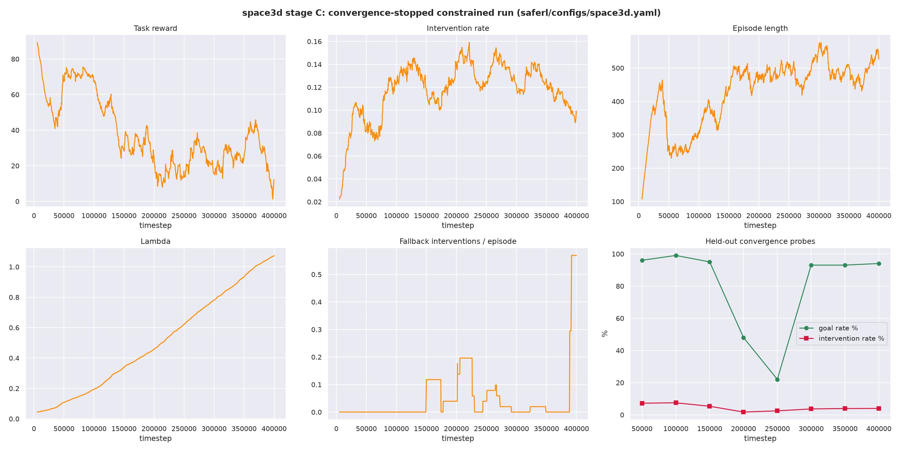
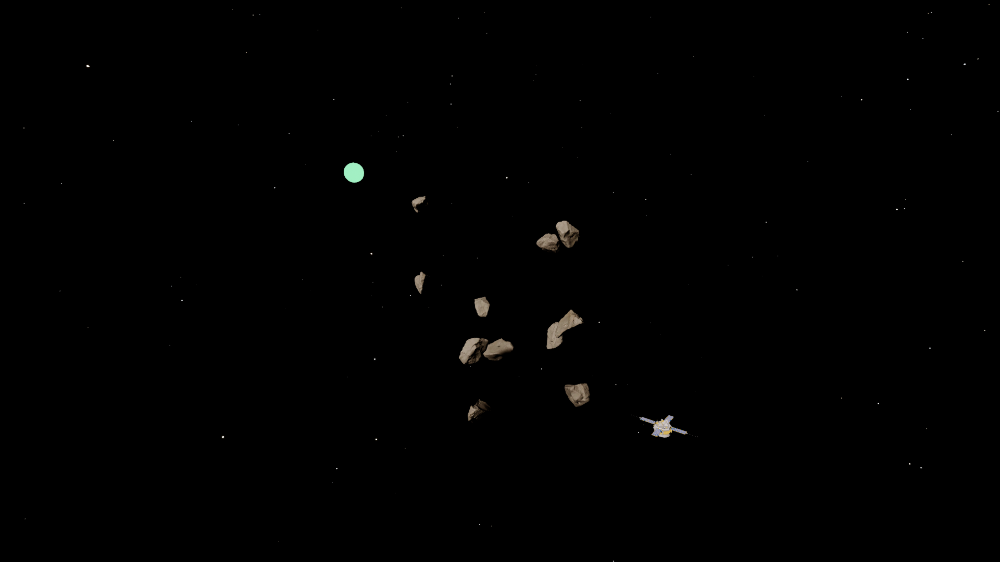
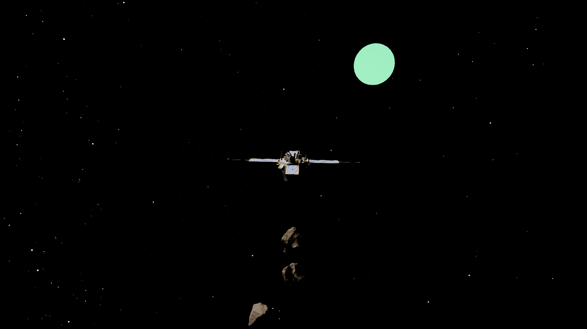
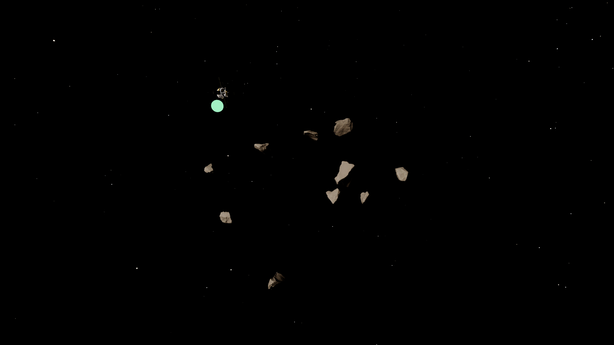

# SafeRL — shielded PPO for satellite navigation through a debris field

A satellite learns to cross a field of drifting debris to reach a goal, with a
safety shield that can override any action it judges unsafe. Training and
physics run in PyBullet; Unreal Engine renders the result. The interesting part
is the tension between the two halves: the shield makes the agent *safe* for
free, and the constrained-PPO layer then has to teach the policy to stop
*needing* it — which is the part that does not come for free.

- **Hard layer** — an analytic shield that propagates every candidate action over
  a 20-step horizon and picks the least-restrictive safe one. 0 collisions in
  150/150 constructed head-on encounters that kill an unshielded agent 150/150.
- **Soft layer** — PPO with a separate cost critic and a Lagrange multiplier, so
  the policy is penalised for triggering the shield rather than only protected
  by it.
- **Partial observability** — the policy sees hazards within 6.0 units; the
  shield keeps a privileged full view, like a dedicated collision-avoidance
  system with its own sensor path.



## Result

Reported checkpoint: `saferl/eval/phase9/saferl_phase9_best.zip` (450k steps,
selected by phase 9's probe/plateau process). 500 episodes, seed 42,
deterministic, limited sensing.

| Eval condition | Goal rate | Intervention rate | Collisions |
|---|---|---|---|
| **Mixed-curriculum** (config default) | **90.8%** | **6.79%** | 0 |
| **Full fixed 5-hazard** (what the demo shows) | **83.8%** | **6.47%** | 0 |

Both numbers are real and neither supersedes the other — they measure different
difficulty distributions, and phase 10 found they differ because the eval
protocol silently inherits the *training* curriculum (see Limitations). If you
want the one that matches the scene in the animation above, it is **83.8%**.

Zero collisions across every evaluation in the project's history. That is the
shield doing its job, and it is the one result that never wavered.

**The 5% intervention target was not reached, and is probably not reachable
under this architecture.** The constraint asked the policy to trigger the shield
on at most 5% of steps. It settled at a stable 6–7% instead. Through phase 9's
700k-step run the Lagrange multiplier climbed monotonically, 1.79 → 2.42, with
no sign of levelling off — dual ascent still pushing, the policy not moving. The
honest reading is an equilibrium a couple of points short of the target, not a
target met and not a transient the next run would fix.

For reference, the 700k final checkpoint (where training stopped on plateau
detection) measures 75.2% / 2.73% mixed-curriculum and 65.6% / 2.67% full
5-hazard — better at satisfying the constraint, meaningfully worse at the task.
The 450k checkpoint is the reported one.

### 3D: free flight through a debris volume (phase 11)

The same pipeline, retrained for true 3D flight — zero gravity, six thrust
directions, 12 rocks drifting on all three axes — and rendered in Unreal as
deep space. Reported checkpoint: `saferl/eval/space3d/long/saferl_space3d_best.zip`,
chosen by the same selection rule as 2D. 500 episodes, seed 42, deterministic,
real goal.

| Eval condition | Goal rate | Intervention rate | Collisions |
|---|---|---|---|
| Mixed-curriculum | **92.6%** | **10.29%** | 0 |
| **Full fixed 12-hazard** (what the scene shows) | **81.2%** | **11.97%** | 0 |

The shield's constructed stress test carries over exactly: 0/150 collisions
against 150/150 unshielded. The 5% intervention target is not met in 3D either.
Getting a policy to learn at all took a success-gated goal curriculum — the
first run, from scratch against the far-corner goal, scored 0/100 and learned
to wait out the clock. That failed run, and the gate that caught it, are
documented in phase 11 alongside everything else.



## Run it

**The visual demo** (Unreal + the trained policy, live):

```bash
./run_ue_demo.sh
```

The 3D space scene (free flight, 12 rocks, point stars), with a chase camera:

```bash
./run_ue_demo.sh --config saferl/configs/space3d.yaml --camera chase
```

Switch cameras while it runs with `echo wide > ue_spike/camera_mode` (or `chase`).

One command: it mounts the engine drive if needed, launches the editor, waits
for the PIE session, then runs the reported policy for that config (the 450k
checkpoint in 2D, `saferl_space3d_best.zip` in 3D) with per-episode metrics
streaming to your terminal. Ctrl-C stops both. The policy runs in a separate
process and Unreal mirrors its state — UE 5.8 embeds Python 3.11, this venv is
3.14, and torch/SB3 are interpreter-locked, so the policy cannot run inside the
editor. UE renders; it does not simulate.

**The fast check** (no Unreal needed, a few seconds):

```bash
.venv/bin/python -m saferl.demo.run_demo --episodes 10
```

**Reproduce the reported numbers:**

```bash
# mixed-curriculum (90.8% / 6.79%)
python -m saferl.eval.evaluate --checkpoint saferl/eval/phase9/saferl_phase9_best.zip
# full fixed 5-hazard (83.8% / 6.47%)
python -m saferl.eval.evaluate --checkpoint saferl/eval/phase9/saferl_phase9_best.zip --no-curriculum
```

**Training curves** (historical, from the phase 9 run — not a live dashboard):

```bash
tensorboard --logdir saferl/eval/phase9/tb/
```

**Tests:**

```bash
pip install -r requirements.txt
pytest tests/          # 40 tests
```

## Architecture at a glance

| Module | What it does |
|---|---|
| `saferl/env/base_env.py` | `SafeNav3DEnv` — PyBullet env, 39-wide obs, drifting debris, sensor-range limiting |
| `saferl/shield/safety_shield.py` | `SafetyShield` (forward-model safety check, least-restrictive substitution) + `ShieldedEnv` wrapper |
| `saferl/training/dual_critic.py` | `ConstrainedPPO` + `DualCriticPolicy` — separate cost critic, Lagrangian dual ascent |
| `saferl/training/train_phase9.py` | Convergence-stopped training run with probe-based checkpoint selection |
| `saferl/eval/evaluate.py` | The authoritative eval protocol (500 ep, seed 42, deterministic) |
| `saferl/demo/run_demo.py` | Fast headless demo |
| `saferl/demo/live_policy_bridge.py` | Runs the real env/shield/policy and publishes state for UE to mirror |
| `ue_spike/` | Unreal project — scene build, PIE session driver, sourced assets |
| `saferl/configs/default.yaml` | Every tunable, with the reasoning for each value written next to it |

## Limitations and honest caveats

1. **The 5% intervention target was not met** (6.79% / 6.47% measured; λ still
   climbing at 700k). Detailed above.
2. **The eval protocol inherits the training curriculum.** `evaluate.py` reads
   `curriculum: true` from config, and a fresh env restarts the ramp at episode
   0 — `num_hazards = min(max_hazards, 1 + episode_count // 50)` — so a
   500-episode run spends its first 200 episodes at 1–4 hazards. Roughly 40% of
   every figure published before phase 10 was measured below full difficulty.
   Found in phase 10; both conditions are now reported side by side, and
   `--no-curriculum` plus a condition stamp in `eval_summary.csv` exist so it
   cannot be misread again. Nothing was wrong with the old numbers *as
   measured* — they were just labelled as if they meant something slightly
   broader than they did.
3. **Probe-vs-held-out variance is large.** Phase 9 selected its checkpoint on a
   100-episode probe that read 100%; the 500-episode held-out eval of the same
   weights read 90.8%. A 9pp gap is not noise at that sample size, and it means
   probe-based selection is optimistic by construction.
4. **Phase 7's original improvement claim was not apples-to-apples.** It compared
   training-time averages against phase 6b's training-time averages. Phase 8
   re-measured both under the real protocol and the improvement held up (66.6%
   → 89.2% under matched conditions), but the originally *reported* delta was
   not a like-for-like number. The phase 7 and 8 sections below preserve both.
5. **Unreal is a renderer, not a simulator, and that was measured.** Phase 4
   found UE's step rate ceilings at ~119 steps/sec regardless of batching —
   world ticks stayed flat at 88–119/s whether stepping 1 or 50 times per frame.
   PyBullet does ~1090/s. Training therefore runs in PyBullet; UE renders.
6. **Two known cosmetic issues in the Unreal scene.** One of five rock slots
   renders as a plain sphere despite mesh path, vertex count, material and world
   position all checking out (phase 8c eliminated 7 hypotheses; it is visible in
   the demo animation). And the NASA starmap dome renders but reads as dark
   grain rather than stars. Phase 10 blamed scale (stars below one rendered
   pixel); **phase 11 showed that wrong** — angular resolution does not depend
   on dome radius, and 33x emissive gain under locked exposure still produced
   no stars — without isolating the real cause. The 3D space scene draws
   procedural point stars instead, labelled as procedural. The sphere-rock
   issue does not appear in the 3D scene's own level.
7. **The 2D scene has a ground plane.** The planar env inherits one from
   PyBullet, so the 2D "satellite" flies over a floor rather than through free
   space. Phase 11's 3D config removes it — zero gravity, no plane — and the 3D
   result above is measured there. The 2D env keeps it so every published 2D
   number still reproduces.
8. **3D probes are even more optimistic than 2D ones.** The 3D selection probe
   read 99% goal / 7.45% interventions; held out at full difficulty the same
   weights measure 81.2% / 11.97%. And the 3D "mixed-curriculum" condition never
   reaches full difficulty inside 500 episodes (12 hazards arrive at episode
   550), so quote the full fixed 12-hazard row.

## Possible future work

Not undertaken, and listed so they are not mistaken for gaps that were missed:
reward shaping that credits clean near-miss avoidance (the policy currently gets
no credit for dodging well, only penalties for needing the shield); revisiting
the 5% target with a tighter constraint curriculum or a larger policy, since the
evidence says the current pairing has plateaued; a composite
goal-rate-and-intervention checkpoint-selection criterion instead of goal rate
alone; a real star catalogue (e.g. Hipparcos) for the 3D scene's point stars in
place of procedural ones; and parallel environments, since training is
CPU-bound (the GPU measured slower for this network size).

---

# Project history

Everything below is the phase-by-phase record, written at the time each phase
ran and left unedited since — including the phase 6 collapse and its phase 6b
fix, and the phase 6b/7 eval discrepancy and its phase 8 resolution. It is kept
as-is deliberately: the corrections are the most useful part.

The section immediately following is the original phase-1 README, superseded by
the summary above but preserved for the same reason.

---

This repository contains a Safe Reinforcement Learning (Safe RL) implementation using Probability Shields in a 3D navigation environment. The agent is trained using Proximal Policy Optimization (PPO) to navigate safely while avoiding hazards.

📖 Project Overview

In many RL environments, an agent may encounter unsafe states that can lead to failures or hazards. Probability Shields act as a safety layer, modifying or overriding unsafe actions in real-time to prevent collisions or unsafe behavior.

This project demonstrates:

A 3D Safe RL environment using PyBullet and Gymnasium.
Implementation of a SafetyShield wrapper to enforce safety constraints.
Training an RL agent using Stable Baselines3 PPO.
Collection of metrics including rewards, interventions, and safety violations.
Visualization of agent performance and safety compliance.

🛠 Features

Custom 3D navigation environment (SafeNav3DEnv)
Hazard generation with curriculum learning
Safety interventions via Probability Shields (SafetyShield)
Metrics collection (MetricsCallback) for rewards, costs, and interventions
Training with Stable Baselines3 PPO
Visualization of rewards, crashes, and interventions
3D demo of the trained agent

💻 Installation

Clone the repository and install dependencies:

git clone https://github.com/nitinn889/SafeRL.git


Dependencies:

Python >= 3.8
gymnasium
pybullet
numpy
torch
stable-baselines3
matplotlib
seaborn

⚙️ Usage

As of Phase 2 the code lives in the `saferl/` package (see the Phase 2
section below) instead of a single script. Install dependencies, then:

1. Train the agent
```
pip install -r requirements.txt
python -m saferl.training.train
```
This trains the PPO agent in the SafeNav3DEnv with safety interventions,
using `saferl/configs/default.yaml` for all hyperparameters. Metrics such
as rewards, cumulative crashes, and interventions are collected, and the
trained model is saved to `saferl_model.zip`.

2. Visualize training results
Graphs for rewards, total crashes, and interventions are saved to
`saferl_metrics.png` automatically at the end of training.

3. Run 3D demonstration
```
python -m saferl.demo.run_demo
```
Launches a PyBullet GUI showing the trained agent (loaded from
`saferl_model.zip`) navigating the environment while avoiding hazards.

4. Run tests
```
pytest tests/
```

📊 Results

After training, you can visualize:

Episode Rewards: Agent performance per episode.
Cumulative Crashes: Number of unsafe collisions over time.
Interventions: Number of times the Probability Shield intervened to prevent unsafe actions

🔬 References
Stable Baselines3 Documentation
PyBullet Documentation
Safe Reinforcement Learning with Probability Shields: Relevant research papers

⚡ Notes
Training time may vary depending on GPU/CPU.
Adjust total_timesteps in the training script to control training duration.
Safety interventions ensure the agent avoids hazards but may limit exploration initially.

---

## Phase 2 (2026-09-11): UE viability spike + repo restructure

### Goal A: UE Python-API viability spike -- executed, result inconclusive, my recommendation is the fallback

The drive holding UE 5.8 (`/dev/nvme0n1p3`, `/mnt/bigdata`) got mounted and
the spike ran for real. Full writeup with both measurements and the
reasoning: [`ue_spike/README.md`](ue_spike/README.md). Short version:

- **Commandlet-mode measurement (real, but not the number that matters):**
  `./ue_spike/run_spike.sh` ran 500 `reset()`/`step()` calls against a
  placeholder actor through UE's in-process Editor Python API (chosen
  over an external-process + Remote Execution setup -- fewer moving parts)
  headless via `UnrealEditor-Cmd -run=pythonscript -nullrhi -unattended`.
  Stable across two runs, no crash: **~179,000-181,000 "steps"/sec**. But
  this is a single Python script executing with no running frame loop at
  all between calls -- it's the floor cost of a Python-to-C++ property
  accessor call, not a per-simulated-frame rate. It was never going to be
  the bottleneck, and isn't informative for training-speed purposes on
  its own.
- **Tick-driven measurement (blocked):** tried to get a number bound by a
  real running engine loop by registering a per-tick callback and driving
  one step per actual engine tick, launched as a persistent (non-
  commandlet) process. Tried 4 ways (`UnrealEditor-Cmd`/`UnrealEditor` x
  with/without `-unattended`); all four self-terminated within 1-2 ticks
  regardless of the registered callback -- a bare `-nullrhi` editor with
  no PIE/game session apparently has nothing it considers worth staying
  alive for. That's a real finding: sustaining a persistent headless
  training loop needs a running PIE/`-game` session, not just a Python
  callback -- more infrastructure than this spike's scope.
- **Arithmetic:** `saferl/configs/default.yaml` trains for
  `timesteps: 30000`. At the (not representative) 180k/s call-overhead
  number that's ~0.17s; at a genuine physics-tick rate it could be
  anywhere from a few seconds to tens of minutes depending on whether
  headless UE throttles ticks toward real-time (30-120fps) or runs much
  faster unthrottled with nothing to render -- a spread wide enough that
  guessing isn't useful, and PPO here will likely want well beyond 30k
  steps once the shield/reward move past placeholders, widening the gap
  further.
- **For comparison, a known quantity:** this session's PyBullet regression
  check (below) trained the full 30k-timestep run in ~28s at ~1090 fps,
  headless, no extra infrastructure.

**My recommendation** (yours to accept or override, not decided
unilaterally): default to the fallback -- train in the existing PyBullet
env, use UE only for rendering/demo playback of a trained policy. That
needs no new engineering (`saferl/demo/run_demo.py` already renders via a
GUI env; swapping renderers later is a smaller lift than making UE the
live training loop now). If you'd rather pursue direct-UE training, the
concrete next step is a follow-up spike measuring step rate inside an
actual running PIE/`-game` session -- say so and that's the next thing to
build, not this fallback.

### Goal B: Repo restructure -- done

`2.py` (used as source of truth over the near-duplicate `Saferl.py`, which
is now removed) has been split into a package:
```
saferl/
  env/base_env.py        SafeNav3DEnv (PyBullet)
  shield/safety_shield.py SafetyShield, ShieldedEnv
  training/train.py       training entrypoint (python -m saferl.training.train)
  training/metrics.py     MetricsCallback
  configs/default.yaml    all hyperparameters (size, max_hazards, force_mag,
                           SAFE_DIST, TIMESTEPS, etc. -- no more magic numbers in code)
  demo/run_demo.py        visual demo entrypoint, loads a saved model
tests/test_env.py         reset/step shape checks + shield intervention tests
```
`2.py`'s three bugfixes are preserved as-is: obs tracked in `ShieldedEnv`
(not re-fetched from the base env), `make_env` is a factory function (not
a lambda), and the cost accumulator resets on episode boundaries in
`MetricsCallback`.

Two behavioral changes from splitting one script into a package: `train.py`
now saves the trained model to `saferl_model.zip` (so `run_demo.py` can
load it independently -- the original script kept `model` in memory and
ran the demo in the same process), and `SafetyShield.safe_dist` /
`force_mag` moved from hardcoded class attributes to constructor params
read from `configs/default.yaml`. No env physics, reward shaping, or shield
logic changed.

**Regression check, run this session:** `python -m saferl.training.train`
with the default config (30,000 timesteps, PyBullet DIRECT mode) completed
in ~28s at ~1090 fps, trained without errors, and saved a model. Both the
restructured version and the original untouched `2.py` produce **0
completed episodes** in that run and therefore no metrics plot -- verified
identical on both, so this is not a regression, but a pre-existing
characteristic worth flagging: the env has no episode step cap
(no `TimeLimit`), and with `SAFE_DIST=2.2` vs. `hazard_threshold=1.3` the
shield tends to steer the agent away before a hazard collision can ever
set `done=True`, while reaching the goal under an early-training policy is
rare enough that a single episode can run past 30k steps without
terminating either way. Worth deciding in Phase 3: add a max-episode-step
limit, or otherwise loosen why episodes rarely end.

`tests/test_env.py` (5 tests: obs shape on reset, step doesn't crash across
all 4 actions, shield intervenes near a hazard, shield leaves a clear-path
action alone, `ShieldedEnv` tracks `_last_obs` without reaching back into
the base env) all pass.

### Open questions / deferred decisions

1. **UE go/no-go** -- measured, but inconclusive (see Goal A above): the
   number obtained isn't the one that determines training speed, and my
   recommended fallback (PyBullet-primary, UE-for-rendering) is a
   recommendation, not a decision made for you. Confirm or override it,
   and say if you want the PIE-based follow-up spike instead.
2. **Episodes essentially never terminate** in the current env/shield
   combination (see regression check above) -- not fixed this phase since
   phase 2 scope explicitly excludes redesigning env/shield logic, but
   Phase 3's shield redesign should account for it.
3. Local-only files `SafeRL_SpaceDebris_Project.md` and
   `saferl_debris_capture/` (present in the working directory from Phase 1
   but never pushed) were left untouched and uncommitted -- out of scope
   for this phase's changes; tell me if you want them added.

### What Phase 3 should assume

- `saferl/` is the source of truth; `2.py`/`Saferl.py` are gone (still in
  git history if needed).
- The PyBullet env (`saferl/env/base_env.py`) trains and passes tests, but
  produces no completed episodes at the current 30k-timestep default --
  don't treat "0 episodes" test output as a new bug introduced by whatever
  Phase 3 changes; it predates this restructure.
- The current `SafetyShield` is still the phase-1 placeholder (random
  action near a hazard) -- real shield logic is explicitly Phase 3/5 scope.
- Default to PyBullet as the training env (this session's recommendation
  pending your sign-off, see Goal A above) with UE reserved for rendering.
  Direct-UE training is not ruled out, but treat it as unvalidated until a
  PIE-based follow-up spike measures real physics-tick throughput -- the
  measurement taken this phase was call-overhead only, not representative
  of training speed.

---

## Phase 3 (2026-09-11): UE Editor + PIE live, episode-termination fix, untracked files landed

### Goal A: UE Editor + PIE running with the environment visible -- achieved

The full Unreal Editor GUI comes up (Vulkan, real rendering -- not headless,
not `-nullrhi`, not a commandlet), spawns the satellite, five debris cubes,
a goal marker and a light, starts a real Play-In-Editor session, and drives
the phase 2 `reset()`/`step()` loop against the PIE-world actor.

Run it with:
```bash
SAFERL_RUN_PIE=1 /mnt/bigdata/unreal_engine/Engine/Binaries/Linux/UnrealEditor \
    ue_spike/SafeRLUESpike.uproject -nosound -log
```
`init_unreal.py` picks up `SAFERL_RUN_PIE=1` and arms
[`ue_spike/Content/Python/pie_session.py`](ue_spike/Content/Python/pie_session.py).
Launched natively, not through Docker -- the engine on `/mnt/bigdata` runs
directly and no container was needed.

**Measured tick-bound rate: ~119 steps/sec** (500 steps in 4.20s;
reproduced at 118.4 / 119.1 / 119.0 across three runs, recorded in
[`ue_spike/pie_session_results.json`](ue_spike/pie_session_results.json)).
The session stayed alive well past the 500-step requirement, and the loop
exercised `reset()` too: the satellite reached the goal and reset 3 times
during the run. This is the number phase 2 could not get -- one env step
per rendered engine frame, capped by the actual frame rate.

Visual record, rendered by the engine itself during the live session:

([`pie_session_midrun.png`](ue_spike/pie_session_midrun.png),
[`pie_session_final.png`](ue_spike/pie_session_final.png)) -- the large
sphere is the goal marker, the smaller sphere the satellite mid-traverse,
and the five cubes are the debris field. These are `SceneCapture2D` renders
rather than desktop screenshots: this host is Wayland, and X11 screen grabs
of the editor window come back solid black.

**Does this change the phase 2 recommendation? No -- it confirms it, and now
on real evidence rather than a guess.** At 119 steps/sec:

| | 30k steps (current default) | 1M steps |
|---|---|---|
| UE live PIE | ~4.2 min | ~2.3 hours |
| PyBullet (measured, phase 2 + re-run this phase) ~1090/s | ~28 sec | ~15 min |

UE is ~9x slower, which is survivable for a 30k demo run but not for the
step budgets a real safe-RL curriculum wants. So: **keep training in
PyBullet, use UE for rendering and demo playback** -- same recommendation
as phase 2, now measured rather than assumed. Two caveats worth your
judgement before treating 119/s as a hard ceiling: it is one env step per
*rendered* frame, so uncapping the frame rate, running several env steps
per tick, or suppressing rendering during training could each raise it;
and this is still kinematic actor movement, not UE rigid-body physics
under load. **Confirm or override this and I will follow it** -- I have not
changed direction on my own.

Phase 2 got one conclusion wrong and this phase corrects it: the editor
self-terminating after 1-2 ticks had nothing to do with `-nullrhi` "having
nothing to keep it alive". It is `-ExecutePythonScript`, which quits the
editor as soon as the script returns -- it does exactly the same thing in a
full GUI session. Arming from `init_unreal.py` instead keeps the session
alive indefinitely.

Other things worth knowing about running UE this way on this host:
- PIE hangs during audio device init (SDL/pulseaudio); `-nosound` avoids it.
- A `SceneCapture2D` holding a 1920x1080 target re-renders the scene every
  frame and drags the loop from ~119 to ~6 steps/sec. Screenshots are taken
  after the timed run, never during it.
- UE's log buffering stalls under load and makes a perfectly healthy run
  look hung. The session mirrors progress to `ue_spike/pie_heartbeat.log`
  (gitignored) so you can watch it from outside the engine.

### Goal B: episode-termination bug root-caused and fixed

**Root cause was the physics, not the wrappers.** The termination checks in
`env/base_env.py` were correct and nothing was dropping `done` in
`ShieldedEnv` or `Monitor`. The agent simply could not move:
`sphere2.urdf` loads at **10kg with lateralFriction 0.5**, so once it
settles onto the ground plane it sits behind **~49N of static friction**
while the 4-action set can only produce **12N** of thrust. Measured
directly: under constant thrust the agent travels 0.03 units, and its
velocity is then exactly 0.000 for the rest of the run. Neither the goal
check (12.7 units away) nor the collision check could ever fire -- on any
physics backend.

Compounding it, `applyExternalForce` only persists for a single substep, so
one env step held thrust for 1/240s -- about 0.005 m/s of delta-v.

Fixed at the root, both in the env and both config-driven:
- `agent_friction` (default `0.0`) -- a satellite has no ground to rub
  against; the ground plane is an artifact of the toy env.
- `sim_substeps` (default `10`) -- hold thrust across substeps, decoupling
  the ~24Hz control rate from PyBullet's 240Hz physics rate.

`max_episode_steps` (default `1000`) was added **as well**, not instead:
it returns `truncated=True`, never `done=True`, so a wandering policy gets
an episode boundary while genuine goal/collision termination stays
distinguishable from it.

New regression tests in `tests/test_env.py`, all passing (9 total):
- `test_goal_reached_terminates` -- teleport onto the goal, assert `done`
- `test_hazard_collision_terminates` -- teleport onto a hazard, assert
  `done` and `cost == 1`
- `test_agent_actually_moves` -- sustained thrust must displace the agent
  (the direct guard against the friction lock recurring)
- `test_truncation_fires_without_terminating`

**Training regression re-run** (30k timesteps, PyBullet, default config):
**34 completed episodes** and the metrics plot generated, against **0
episodes and no plot** before the fix. `ep_len_mean` settles around 900,
i.e. most episodes still end at the truncation cap rather than on the goal
-- expected for an untrained policy over 30k steps with the shield
deflecting it away from hazards, and worth revisiting when the real shield
lands.

### Goal C: untracked files landed, unmodified

Both were added exactly as they were, at their existing top-level paths,
with no edits and nothing folded into `saferl/`. At a glance:

- **`SafeRL_SpaceDebris_Project.md`** -- 41KB / 1128-line research and
  development plan: "Probabilistic Shield-Augmented Reinforcement Learning
  for Autonomous Capture of Tumbling Space Debris". Abstract, MDP
  formulation, probabilistic shielding theory, tumbling dynamics, and a
  6-phase 9-12 month timeline. Written around **NVIDIA Isaac Lab**.
- **`saferl_debris_capture/`** -- 540KB, 26 tracked files, an 18-module
  Python package scaffold: `envs/` (Isaac Lab env, 36-D obs / 6-D action,
  Euler-equation tumbling dynamics, reward shaping), `shield/` (a **PRISM**
  DTMC model plus abstraction/query/wrapper), `agents/` (PPO, SAC,
  shielded), `training/`, `evaluation/`, `tests/`, and a `docs/paper_draft.md`.
  `__pycache__` excluded by the existing root `.gitignore`.

Flagging without acting on it: both describe a **different simulation stack
(Isaac Lab + PRISM) than the UE + PyBullet line this repo has followed**,
and that `shield/` scaffold is a real probabilistic shield, which is what
phases 3/5 of the current track were meant to build. That is a direction
question for you, not something this phase resolved.

### Open questions / deferred decisions

1. **UE tick-rate recommendation** -- 119 steps/sec confirms PyBullet-for-
   training / UE-for-rendering, but the ceiling may be soft (see caveats
   above). Confirm, or tell me to chase a higher number.
2. **Two parallel project definitions** -- the newly landed Isaac Lab +
   PRISM plan versus this repo's UE + PyBullet track. Which is the real
   roadmap? This affects everything from phase 4 onward.
3. **The shield is still the phase-1 placeholder** (random action near a
   hazard). Untouched this phase, as scoped.
4. Most episodes still end by truncation rather than by reaching the goal
   (`ep_len_mean` ~900 of 1000). Fine for now; revisit with the real shield.

### What Phase 4 (dynamic debris field) should assume

- Episodes genuinely terminate. `done` fires on goal and on collision,
  `truncated` fires at `max_episode_steps`, and there are tests holding
  each of those in place.
- The env is frictionless with a 10-substep control step. Any new dynamics
  work should keep thrust meaningful relative to mass -- the friction-lock
  failure mode is easy to reintroduce and silent when it happens.
- A live UE PIE session is a solved, repeatable path (`SAFERL_RUN_PIE=1`,
  `-nosound`, arm from `init_unreal.py`, never `-ExecutePythonScript`), at
  ~119 steps/sec, driving actors kinematically from Python.
- Training still runs in PyBullet. Do not move training into UE on the
  strength of this phase alone -- open question 1.
- The debris field is static in both backends. The UE scene uses five
  hardcoded debris positions in `pie_session.py`; the PyBullet env still
  randomizes hazard positions per episode with curriculum scaling.

---

## Phase 4 (2026-09-11): Dynamic debris field + UE throughput experiment

### Goal A: dynamic debris field

**Motion model.** Each hazard is assigned a random heading and a speed drawn
from `[debris_min_speed, debris_max_speed]` (default `0.3` - `1.2` env
units/sec) at spawn, then drifts linearly. Position advances by
`velocity * step_dt` each `step()`, where `step_dt = sim_substeps / 240Hz`
(0.0417s with the current config) so debris motion shares the agent's
control timescale rather than running on an unrelated clock. Hazard bodies
are set to **mass 0 and driven kinematically** — otherwise gravity drops
them and contact impulses knock them off their assigned trajectories.

**Boundary behaviour: reflection (bounce).** Debris reflect off the edges of
the `[0, size]` play area, with both position mirrored and velocity
negated. Reasons for picking this over the alternatives: it keeps the debris
count and therefore the observation layout constant (wrapping and
despawn/respawn both do too, but), and unlike wrapping it never teleports an
object across the field into the agent's path. A wrapped object appearing
adjacent to the agent produces an unavoidable collision — no policy and no
shield could have prevented it — which would inject noise into exactly the
safety signal phase 5's shield has to learn from. Despawn/respawn has the
same problem plus a spawn-placement rule to get wrong.

**Observation space: 24 → 39.** Each hazard block is now `[pos(3), vel(3)]`
instead of `[pos(3)]`, so the policy can see motion instead of inferring it.
`OBS_HEADER_LEN` (9) and `OBS_PER_HAZARD` (6) are exported from
`saferl/env/base_env.py` so the layout has exactly one definition;
`SafetyShield` imports them rather than hardcoding a stride. The shield's
*logic* is untouched — still a position-only distance check that picks a
random action — only its indexing moved onto the new stride. Relative
velocity / time-to-collision reasoning is phase 5's job.

**Collision check uses live positions.** `_advance_hazards()` runs before
both `_get_obs()` and the collision check, so both read this step's state.
This is covered by a test that parks a hazard on the agent mid-episode and
asserts the next step terminates — it fails if either path ever goes back to
reading a reset-time snapshot.

**Curriculum on debris speed: implemented, not deferred.** Matching the
existing hazard-count ramp, when `curriculum` is on the *upper* speed bound
ramps from `debris_min_speed` to `debris_max_speed` over
`debris_speed_ramp_episodes` (default 200). Early episodes face near-static
debris; later ones face the full speed band. The lower bound stays fixed so
there is always some motion to react to.

**Tests: 8 new, 17 total, all passing.** Debris actually move between steps
(catches "velocity stored but never applied"), obs tracks live debris
position and velocity, the collision check uses current positions, boundary
reflection keeps every hazard inside the play area across 200 steps, obs
shape matches the new size, PPO builds and predicts against the widened obs
without crashing, and both curriculum speed paths.

**Training regression:** 30k timesteps, no crash, **30 completed episodes**
and the metrics plot written (phase 3's fixed baseline was 34). As expected,
nobody is dodging anything yet — sampling a random policy over 40 episodes
gives 1 goal / 4 crashes / 35 truncations at ~907 mean episode length.
Moving debris does produce real collisions now, which static debris plus the
deflecting shield largely prevented.

### Goal A: shield-relevant content extracted from the Isaac Lab / PRISM files

Read from `saferl_debris_capture/shield/` and `SafeRL_SpaceDebris_Project.md`
directly rather than from phase 3's one-line summary. The stack (Isaac Lab)
is dead per your call, but the **shield design is stack-independent** and
phase 5 should start from it rather than from scratch. What is actually
specified there:

**1. Three-stage architecture.** `abstraction.py` → `shield_query.py` →
`shield_wrapper.py`: map the continuous observation into a small discrete
state, look up a model-checked probability for each (state, action), and
allow-or-override at runtime. Each stage is independently replaceable.

**2. Abstract state `(d, f, t)` — 45 states.** Distance bucket `d ∈ 0..4`
(0 = contact, 4 = far), contact-force bucket `f ∈ 0..2` (0 = safe,
2 = overload), tumble-rate bucket `t ∈ 0..2`. **Translation needed for this
repo:** `f` (contact force) and `t` (tumbling) don't exist in the navigation
task. The natural analogues are distance-to-nearest-debris and a
**closing-rate / time-to-collision bucket** — which is precisely what the
debris velocity added in this phase now makes computable.

**3. Conservative abstraction rule.** When a continuous value sits near a
bucket boundary, round toward the **more dangerous** bucket, so the shield is
never over-optimistic. Cheap to implement, and worth carrying over verbatim.

**4. Safety spec in PCTL, quantitative and checkable:**
`P<=0.05 [ F<=20 "collision" ]` (collision probability within 20 steps ≤ 5%)
and `P>=0.90 [ F<=50 "captured" ]` (task success within 50 steps ≥ 90%).
Having a written, falsifiable spec is the part the current placeholder
shield most obviously lacks.

**5. Override rule: least-restrictive safe action.** If
`P(collision | state, action) > threshold` (default 0.05), substitute the
action that minimises collision probability **while still making progress** —
explicitly not a random action. This is the single biggest delta from this
repo's current shield, which picks uniformly at random from all four
directions and can therefore steer *into* a hazard.

**6. Offline table vs online PRISM.** The design precomputes a
`(num_states, num_actions)` probability table offline and loads it as a
numpy array — zero subprocess overhead per step. Online PRISM invocation is
~100ms/call, which it flags as offline-analysis-only. At ~1090 steps/sec in
PyBullet, anything but a table lookup is a non-starter in the training loop.

**7. Transition probabilities calibrated from rollouts**, not hand-waved:
the `.pm` file's constants are annotated as estimated from offline rollouts
of the dynamics model, with a `shield/estimate_transitions.py` step in the
plan to produce them.

**8. Structured intervention logging** — each intervention records state,
proposed action, substituted action, collision probability and threshold.
This repo currently keeps only an integer counter.

**9. References the design cites:** Jansen et al., *Safe Reinforcement
Learning Using Probabilistic Shields* (CONCUR 2020); Hasanbeig et al.,
*Cautious Reinforcement Learning with Logical Constraints* (AAMAS 2020).

Nothing from these files was implemented this phase, per scope.

### Goal B: UE throughput experiment

Same 500-step protocol as phase 3, four configurations. `pie_session.py`
gained `SAFERL_UNCAP`, `SAFERL_STEPS_PER_TICK` and `SAFERL_RESULTS_NAME`;
defaults reproduce the phase 3 protocol exactly.

| configuration | steps/sec | world ticks for 500 steps | world ticks/sec |
|---|---|---|---|
| capped + throttled, 1 step/tick | 4.2 | 500 | 4.2 |
| **uncapped, 1 step/tick** | **119.0** | 500 | **119.0** |
| uncapped, 10 steps/tick | 1117.3 | 50 | 111.7 |
| uncapped, 50 steps/tick | 4426.3 | 10 | 88.5 |
| *(PyBullet, for reference)* | *~1090* | — | — |

**Two findings, and the second is the one that matters.**

First, phase 3's 119/s was measured with the editor window focused.
Unfocused, the editor throttles to **4.2 steps/sec**. `Slate.AllowThrottling 0`
(alongside `t.MaxFPS 0` and `r.VSync 0`) makes 119/s reproducible regardless
of focus. So 119 was a real number, but it needs those CVars to be dependable
— use `SAFERL_UNCAP=1` for any future measurement.

Second: **the frame-rate ceiling is not soft, and batching does not lift it.**
Look at the last column — world ticks/sec stays flat at 88-119 across every
configuration. Stepping 10 or 50 times per rendered frame does not make UE
simulate faster; it performs more Python-side transform writes *between* the
same ~119 frames. Those extra steps advance no UE physics at all, which is
exactly the caveat that made phase 2's 180,000/s number meaningless.

So: if an env step has to advance UE's own physics — the entire premise of
using UE as the simulator rather than a renderer — **~119 steps/sec is the
real ceiling**, roughly 9x slower than PyBullet, the same ratio phase 3
reported. **The phase 2/3 recommendation stands: train in PyBullet, use UE
for rendering and demo playback.** I did not change the backend, and there is
no new evidence here that would justify revisiting it. Per the time-box, I
stopped after one clean measurement set rather than chasing exotic tuning.

### Open questions / deferred decisions

1. **Debris speed band** (`0.3` - `1.2` env units/sec) was chosen to be
   visibly dynamic without being unavoidable, not calibrated against
   anything physical. If you want Kuiper-belt-realistic relative velocities,
   that is a modelling decision worth making deliberately in phase 5 or 6.
2. **Debris motion is linear, not orbital.** No gravity wells, no relative
   orbital mechanics, and debris pass through each other. Fine for a
   reaction-to-motion task; flagged in case the realism matters later.
3. **The reward is unchanged** and still gives no credit for near-miss
   avoidance, so with moving debris the agent is scored almost entirely on
   goal-reaching and crashes. Worth revisiting alongside the shield.
4. **Untouched from phase 3:** the shield is still the random-action
   placeholder, and the action space is still `Discrete(4)`.

### What Phase 5 (shield redesign) should assume

- **Debris move, and the observation carries their velocity.** Obs is 39-wide
  for `max_hazards=5`: `[agent_pos(3), agent_vel(3), goal_pos(3)]` then
  `[pos(3), vel(3)]` per hazard. Use `OBS_HEADER_LEN` / `OBS_PER_HAZARD` from
  `saferl.env.base_env` rather than hardcoding offsets — changing the layout
  again means changing them in one place.
- **Closing rate is now computable** from the observation, so a
  time-to-collision shield is buildable without touching the env.
- **The shield redesign has a prior design to start from**, summarised above:
  conservative abstraction, a PCTL safety spec, a precomputed probability
  table, and least-restrictive-safe-action overrides instead of random ones.
  The random-action placeholder is actively harmful with moving debris — it
  can steer into a hazard — so replacing the override rule is the highest-value
  single change.
- **Training stays in PyBullet** (~1090 steps/sec), measured again this phase.
  UE remains rendering/demo only, at a confirmed ~119 steps/sec ceiling.
- **Any UE session needs `SAFERL_UNCAP=1`** to avoid the 4.2/s background
  throttle, plus `-nosound` and arming via `init_unreal.py`.
- Episode termination, the friction fix and the truncation backstop from
  phase 3 are all intact and covered by tests (17 passing).

---

## Phase 5 (2026-09-12): Real shield — least-restrictive safe action

Replaces the phase-1 placeholder with an analytic hard-constraint layer. The
soft/learned half of the hybrid design (constrained PPO, cost-value head) is
untouched and remains phase 6's job.

### Goal B first: does the new shield actually avoid collisions the old one caused?

This is the number that matters, so it goes before the design description.

Randomly spawned debris almost never produce a genuine collision course, so
`saferl/eval/stress_test.py` **constructs** them: pick an intercept time,
propagate the agent's un-shielded trajectory analytically
(`p0 + v0·t + ½a·t²`), and place each hazard so that it arrives at that point
at that time. The encounter is then guaranteed and the shield is the only
variable. Six scenarios × 25 trials × three arms:

| scenario | no shield | old (random replacement) | new (least-restrictive) |
|---|---|---|---|
| `closing_head_on` — debris drifting back down the agent's path | 25/25 | 25/25 (24 intervention-implicated) | **0/25** |
| `crossing_from_right` — perpendicular cut across the path | 25/25 | 25/25 (25) | **0/25** |
| `crossing_from_left` — mirror image | 25/25 | 25/25 (25) | **0/25** |
| `parked_obstacle` — stationary, on the path (control case) | 25/25 | 25/25 (25) | **0/25** |
| `surrounded` — four stationary hazards ringing the start | 25/25 | 3/25 (3) | **0/25** |
| `pincer` — two converging flanks plus one ahead | 25/25 | 25/25 (25) | **0/25** |
| **total collisions** | **150/150** | **128/150** | **0/150** |

Mean closest approach to any hazard tells the same story: 1.14–1.29 units
un-shielded, 1.17–1.60 under the old shield, **2.01–2.28 under the new one**
— i.e. the new shield holds the 2.2-unit safe distance it is configured to
hold, while the old one barely improved on having no shield at all.

**The specific flaw being fixed, measured.** "Intervention-implicated" above
counts collisions that occurred within one lookahead window of an
intervention that thrust the agent *toward* the hazard that triggered it.
That audit is pure geometry — the dot product of the substituted thrust
direction with the unit vector from agent to hazard — so it judges both
shields on identical terms rather than through the new shield's own model:

| | old shield | new shield |
|---|---|---|
| mean interventions that thrust toward the triggering hazard | 2.7 – 29.1 per episode | **0** (single-hazard scenarios) |
| collisions implicated by such an intervention | **127 of its 128** | **0** |

So the old shield's collisions were not incidental: essentially every one of
them was preceded by the shield itself steering the agent into the hazard.
That is the concrete, measured version of the flaw phase 4 predicted from the
PRISM design notes.

Two honest caveats. First, in `surrounded` and `pincer` the new shield also
registers "toward-hazard" interventions (30 and 18 per episode) — with debris
on several sides, every direction is toward *something*, so the metric is only
sharp in single-hazard scenarios; its value is that it correlates with
collisions for the old shield and not for the new one. Second, `no_shield`
collides 150/150, which is what makes the comparison meaningful: these
scenarios are lethal by construction, not cherry-picked near-misses.

**Horizon calibration, found the hard way.** At the initially-chosen
`lookahead_steps=20` (0.83 s), the new shield *still* collided 3/3 on
`closing_head_on` and every single intervention was a boxed-in fallback. The
cause is not the selection logic but the horizon: clearing a 2.2-unit safe
radius sideways from rest at `a = force_mag/mass = 1.2 m/s²` needs
`0.5·a·t² ≥ ~1.3`, i.e. **t ≈ 1.5 s ≈ 36 steps**. A shorter horizon only sees
threats that are already unavoidable. At 30 steps it is 0/3 with no
fallbacks; the default is **40 steps (~1.67 s)**, with the derivation written
into `configs/default.yaml` next to the value.

Reproduce with `python -m saferl.eval.stress_test --trials 25`; the table and
raw JSON are checked in at `saferl/eval/stress_results.{txt,json}`.

### Goal A: how the new shield decides

**The trigger now uses relative velocity, not just distance.** For each of
the four actions the shield propagates a forward model over the lookahead
window and rejects any action predicted to come within `safe_dist` of any
hazard:

- agent: constant thrust for the whole horizon, `p(t) = p0 + v0·t + ½a·t²`,
  with `a` read from `ACTION_THRUST_DIRS` in `base_env.py`;
- debris: constant velocity, `h(t) = h0 + hv·t`, read straight out of the
  observation's `[pos(3), vel(3)]` blocks.

Separation is sampled at each of the 40 step boundaries; the action is unsafe
if the minimum falls below `safe_dist`, and its *time-to-violation* is the
first sample time at which it does. `t = 0` is deliberately excluded — the
question is whether this action *leads into* a hazard, not whether the agent
happens to be near one already. A hazard five units away closing at 3 units/s
now triggers, and the identical geometry with the hazard receding does not;
the old distance-only check cannot tell those apart, and a test asserts it
misses the closing case outright.

**"Least different from intent" is measured in thrust vectors, not action
indices.** Action indices are meaningless as a distance metric — 0 and 1 are
adjacent indices but opposite directions (+Y and −Y). The metric used is the
**Euclidean distance between the two actions' commanded thrust vectors**,
which is physical: 0 for the same action, `|a|·√2 ≈ 1.70` for a perpendicular
sidestep, `2|a| = 2.4` for a full reversal. The shield picks the safe action
minimising that distance, so a sidestep always beats a reversal. Ties — a
left and a right sidestep are exactly equidistant from a forward intent — are
broken toward the larger predicted clearance, so the shield dodges away from
the second-nearest hazard rather than into it.

**Boxed-in fallback.** When no action holds `safe_dist` over the horizon, the
shield picks the action maximising time-to-violation (tie-broken on
clearance) — buy time rather than give up. This is tracked distinctly
everywhere:

- `SafetyShield.n_fallback` vs `n_substituted` vs `n_triggered`;
- `ShieldedEnv.fallback_interventions` alongside `interventions`;
- `MetricsCallback.episode_fallback_interventions`, plotted as a second line
  on the interventions panel;
- `ShieldDecision.kind ∈ {"none", "substituted", "fallback"}`.

It is a genuinely different situation — "I chose the least-bad option" rather
than "I found a safe one" — and `surrounded` shows why it still matters: the
fallback fires on all 60 steps of every trial and the agent survives all 25,
while the un-shielded arm dies 25/25.

**Richer intervention record.** Every check produces a `ShieldDecision`
(proposed action, executed action, triggering hazard index, predicted minimum
distance, time-to-violation, thrust deviation, how many safe actions
existed), kept on `shield.last_decision` and optionally appended to
`shield.log` with `keep_log=True`. This is point 8 of the PRISM extraction
from phase 4, and it is what phase 9's evaluation suite will read.

**`ShieldedEnv` did change, slightly.** Its role is unchanged — call the
shield, count, pass through; it makes no safety decisions. The one addition is
the `fallback_interventions` counter, which it fills by reading
`shield.last_decision.kind`. Collapsing fallbacks into the single
intervention count would have discarded exactly the signal phase 9 needs, and
the counter is bookkeeping rather than logic, so it belongs in the wrapper.
`check_and_fix` still returns the same `(action, intervened)` 2-tuple it did
in phase 1, so nothing else needed touching.

**Supporting change in `base_env.py`.** `ACTION_THRUST_DIRS` and `AGENT_MASS`
now live there as the single definition of what an action means; `step()` and
the shield both read them. Previously `step()` hardcoded the four force
vectors, so a shield with its own copy could have silently drifted out of
sync and confidently guarded the wrong world. A test asserts the env's actual
measured acceleration matches the table for every action, and another asserts
`AGENT_MASS` still matches the URDF.

### Goal C: tests and training regression

**Tests: 32 passing** (was 17). `tests/test_shield.py` is new and holds 18;
`tests/test_env.py` keeps the 14 environment tests. The three shield tests
that were in `test_env.py` moved across unchanged in intent — so all 17
phase-4 tests still exist and still pass, they are just split by subject now.
Their observation fixtures were rebuilt on the live 39-wide layout via
`OBS_HEADER_LEN`/`OBS_PER_HAZARD`; the old ones were hand-built on the
pre-phase-4 24-wide stride and only passed by accident.

Covering the four required cases: a hazard closing by velocity alone (with
the receding mirror image, and an assertion that the old shield misses it);
sidestep-preferred-over-reversal with a determinism check across 20 repeated
calls; the boxed-in fallback picking the flee direction that delays the
breach longest; and four no-intervention regressions, including a hazard
tracking alongside the agent at matched velocity — close, but never closing.

**Training regression: 30k timesteps, no crash.** 30 episodes recorded (phase
4's baseline was also 30), 1036 fps — the shield's per-step cost is not
measurable against PyBullet's, since the whole lookahead is one vectorised
`(4 actions × 5 hazards × 40 samples)` numpy pass. Interventions are logged
with the new signal: `30720 checks, 54 triggered (54 substituted, 0 boxed-in
fallbacks)`.

A same-seed 30k run under each shield:

| | episodes | goals | crashes | truncations | triggered |
|---|---|---|---|---|---|
| old random shield | 31 | 0 | 1 | 30 | 200 |
| new shield | 30 | 0 | **0** | 30 | 181 |

As expected and as phase 4 predicted, the policy has not learned to navigate
— every episode still ends at the 1000-step truncation cap, and reward is
flat at −100 (the accumulated step cost). **One crash avoided is a sample of
one** and should not be read as a training-time safety result; the stress
test is where the real evidence is. The point of this run is that nothing
crashed, episodes are still recorded, and the richer intervention signal
flows all the way through to the plot.

### Open questions / deferred decisions

1. **`safe_dist = 2.2` is marginal against the agent's control authority.**
   At 1.2 m/s² the agent needs ~1.5 s to clear that radius sideways, which is
   why the horizon has to be so long. Either number could move: a smaller
   `safe_dist`, a larger `force_mag`, or slower debris would all buy margin.
   I left all three alone because changing them would invalidate the phase
   3/4 baselines mid-comparison — but this is a real tuning decision and
   it is yours.
2. **The forward model ignores boundary reflection.** A hazard predicted to
   fly out of the play area actually bounces. Ignoring it is the conservative
   direction (a bounce can only move a hazard away from its straight-line
   prediction near a wall), so I left it, but it makes the shield slightly
   pessimistic near edges.
3. **The lookahead assumes the action is held for the full horizon**, which
   it is not — the shield re-decides every step. This makes the check
   conservative rather than optimistic, which is the right way to be wrong,
   but it does mean the shield rejects some actions that would in fact have
   been recoverable.
4. **No PCTL spec yet.** Points 2, 3, 4, 6 and 7 of the phase-4 PRISM
   extraction (abstract state buckets, conservative rounding, a written PCTL
   safety spec, an offline probability table, rollout-calibrated transition
   probabilities) are still unimplemented. This phase built the deterministic
   analytic layer only. Whether the probabilistic layer is worth adding on
   top is a real question, not a foregone conclusion — the analytic shield
   already scores 0/150.
5. **The reward still gives no credit for near-miss avoidance**, carried over
   from phase 4 and now more pointed: the shield is doing safety work the
   policy is never rewarded for and cannot see.

### What Phase 6 (constrained PPO / learned soft layer) should assume

- **The hard layer is real and works.** `SafetyShield` enforces a
  velocity-aware constraint and picks the least-restrictive safe action;
  0/150 collisions on scenarios that kill an unshielded agent 150/150. Phase
  6 adds the *soft* layer on top — it does not need to re-derive this one.
- **Interventions carry structure now.** `ShieldDecision` per step,
  `n_triggered`/`n_substituted`/`n_fallback` on the shield,
  `interventions`/`fallback_interventions` on `ShieldedEnv`, and both lists on
  `MetricsCallback`. A cost-value head can be trained against the shield's own
  trigger signal, not just the env's terminal `cost`.
- **`check_and_fix(obs, action) -> (action, intervened)` is stable.** Extra
  signal arrives on `shield.last_decision`, so a Lagrangian wrapper can read
  it without changing the call contract.
- **The action space is still `Discrete(4)`** and the observation still 39-wide.
  Continuous control was explicitly out of scope this phase; the shield's
  selection loop enumerates actions, so it would need a different formulation
  (a projection or a QP) to go continuous.
- **The policy still does not reach the goal within 30k steps.** Reward is
  flat at −100 with every episode truncating. Phase 6 should expect to fix
  learning, not just safety — and the shield now guarantees the exploration
  it does is not fatal.
- Training stays in PyBullet (~1036 fps measured again this phase, unchanged
  by the shield). UE remains rendering/demo only.

---

## Phase 6 (2026-09-12): Margin retune + constrained PPO (learned soft layer)

Goal A loosened the physics so a policy has room to work inside the shield's
margin. Goal B added the soft layer: PPO is now penalised for *needing* the
shield, not just protected by it.

### Goal A: margin retune

**`force_mag` 12 N → 48 N** (1.2 → 4.8 m/s² against the agent's 10 kg).
Dodging a hazard means displacing sideways by `hazard_threshold` (1.3) before
it arrives, so `0.5·a·t² ≥ 1.3` gives the reaction time. That is `t ∝ 1/√a`,
so **4× the thrust halves the clearing time**: 1.47 s (~36 steps) → **0.74 s
(~18 steps)**, inside the 15–20 step target. Clearing the full 2.2-unit
`safe_dist` rather than the collision radius takes 0.96 s (~23 steps); both
numbers are quoted because phase 5's "~36 steps" was the 1.3 figure and the
comparison should be like-for-like.

**`lookahead_steps` 40 → 20.** The horizon is what bounds the shield's
reachable set, `0.5·a·(H·dt)²`. At 4× thrust and half the horizon that set is
`0.5·4.8·0.833² = 1.67` units — *exactly* what phase 5 had at `H=40` and
1.2 m/s². So the shield sees the same distance ahead of itself while doing
half the arithmetic per check. Verified by sweep rather than assumed
(6 scenarios × 5 trials):

| horizon H | collisions | fallback interventions |
|---|---|---|
| 8 | 5/30 | 181 |
| 12 | 0/30 | 60 |
| 16 | 0/30 | 60 |
| **20 (chosen)** | **0/30** | **60** |
| 24 / 28 / 40 | 0/30 | 60 |

The empirical floor is H=12; H=20 keeps a margin and sits where intervention
count plateaus (114 at H=20 vs 107 from H=24 on). All 60 remaining fallbacks
come from `surrounded`, which is boxed-in by construction at every horizon.

### Fresh stress baseline under the new physics

Re-run, **not** carried over from phase 5 — these numbers describe the current
config only (6 scenarios × 25 trials):

| arm | collisions | preceded by a toward-hazard intervention |
|---|---|---|
| no shield | 150/150 | — |
| old random-replacement shield | **146/150** | 135 |
| new least-restrictive shield | **0/150** | 0 |

The old shield got *worse* than phase 5's 128/150. That is the expected
direction: more thrust means a wrong random dodge covers more ground, so the
placeholder's failure mode is amplified by exactly the change that helps the
real shield. The new shield stays at zero.

**Three things the physics change broke, all found by measurement:**

1. **The stress scenarios silently stopped testing anything.** They specified
   encounters in *seconds*, so at 4× thrust every intercept point moved
   outside the 10-unit play area — where debris reflect off the boundary and
   leave their designed course. `pincer` degraded to 5/5 collisions with
   *zero* interventions and would have been reported as a shield regression.
   Encounters are now specified as **distance along the path** with the
   harness solving for the time, and a guard raises if an encounter would land
   outside the field, so this cannot pass quietly again.
2. **`tests/test_shield.py` hardcoded `lookahead_steps=40` and
   `safe_dist=2.2`**, combining the new thrust with the old horizon to give
   the shield a 6.67-unit reachable set. One test failed and the rest were
   passing for the wrong reason. Tests now read `configs/default.yaml`,
   `SafetyShield`'s module defaults are *derived* from it rather than
   restated, and `SafetyShield.from_config()` exists for non-default configs.
   The same sweep found and fixed stale literals in `SafeNav3DEnv.__init__`,
   `stress_test.run_comparison` and `test_env.py`.
3. **The agent could leave the universe.** Nothing walls it in and there is no
   drag, so at 4.8 m/s² a wandering policy reached `|xy| ≈ 158` within one
   episode — outside the observation space's own ±20 bounds, with hundreds of
   steps spent where the goal is unreachable and no hazard is in view. See
   below; this turned out to matter far more than it first looked.

### The degenerate escape, and why it had to be fixed first

With leaving the field unpenalised, PPO found a much better idea than doing
the task: **fly out of bounds as fast as possible.** Over 300k steps it
converged by ~70k and sat there — 0% goals, 0% collisions, ~36-step episodes,
task reward flat at −3.6. The arithmetic is not subtle:

| behaviour | return |
|---|---|
| escape immediately (~36 steps) | **−3.6** |
| wander in-field for a full episode | −100 |
| reach the goal (~80 steps) | +92 |
| crash | ≈ −50 |

Escape dominates everything the policy had actually found, and the +92 the
task offers is behind an exploration barrier. Worse, this **starved the soft
layer of any signal**: over the same 300k steps the constrained arm's λ
saturated at its ceiling of 50 and the intervention rate still went *up*
(0.0110 → 0.0120). An agent beelining out of the field has almost no control
over whether debris happen to sit on its exit path, so no multiplier, however
large, can change its behaviour.

**Fix: out-of-bounds terminates with a penalty.** The value is derived
rather than fitted — **−100 equals a full episode's accumulated step cost**
(`max_episode_steps × 0.1`), which is exactly the threshold above which
leaving early stops being better than staying and trying. Swept at 120k steps
to confirm the reasoning survives contact:

| `out_of_bounds_penalty` | goal % | escape % | mean steps | intervention rate |
|---|---|---|---|---|
| 0 | 0.0 | 100.0 | 37 | 0.010 |
| −25 | 40.7 | 50.0 | 460 | 0.244 |
| −50 | 0.0 | 5.9 | 976 | 0.079 |
| **−100 (chosen)** | **42.2** | **20.0** | 659 | 0.224 |

−100 gives the best goal rate and the least escaping. −50 is a trap: the agent
learns to hover in-field for the full 1000 steps and never commits.

### Goal B: the cost signal and the Lagrangian layer

**Cost signal.** `ShieldedEnv` now emits `info["shield_cost"]` — 1 on any step
the shield intervened (substitution *or* fallback), 0 otherwise — plus
`info["shield_fallback"]`. This is deliberately distinct from the env's
existing collision `cost`: *needing the shield* is what the policy should
learn to stop doing, *crashing* is what the shield exists to prevent.

**The multiplier is real; its application is simplified.** Being precise about
which half is which:

- **Real:** λ is updated by a genuine dual-gradient ascent step on the
  constraint violation, at episode boundaries:
  `λ ← clip(λ + lr·(ema_rate − target_rate), 0, λ_max)`.
  It rises while the policy exceeds its budget and decays once under. Not a
  schedule, not a fixed penalty.
- **Simplified:** λ is applied by **shaping the scalar reward**
  (`r' = r − λ·cost`) and learned through PPO's single existing critic. A
  textbook PPO-Lagrangian trains a **separate cost-value head** and forms the
  policy gradient from both critics. This is the same dual variable with one
  critic instead of two. The brief allowed either; this is the simpler one and
  is labelled as such.

The constraint is on intervention **rate**, not the episode total, because the
out-of-bounds backstop makes episode length vary ~4×, and a per-episode budget
would mostly reward ending episodes early.

`enabled=False` pins λ at 0, so the unconstrained baseline runs through
byte-identical plumbing and the comparison isn't confounded by a different
code path.

### CPU vs GPU: measured, and CPU won

| device | 20k timesteps | throughput |
|---|---|---|
| **CPU (now the default)** | **23.89 s** | **837 fps** |
| CUDA | 33.80 s | 592 fps |
| *env + shield alone, no network* | *7.41 s* | *2700 fps* |

Same seed, best of two reps each. **CPU is 1.41× faster.** A 64×64 `MlpPolicy`
has nowhere near enough arithmetic per batch to amortise host↔device transfer.
`training.device: cpu` is now the configured default.

### Constrained-vs-unconstrained training results (400k steps)

Both arms ran for 400k timesteps under identical physics, shield, and OOB
penalty. The only difference is whether λ can rise above 0.

**Unconstrained arm** (891 episodes):

| decile (timestep) | task reward | intervention rate | ivs/episode | steps | goal % |
|---|---|---|---|---|---|
| 38k  | −109.9 | 0.041 |  23.6 | 436 |  10.1 |
| 89k  |  −56.4 | 0.165 |  93.9 | 564 |  36.0 |
| 192k |  −31.1 | 0.205 | 117.9 | 513 |  48.3 |
| 268k |  +46.5 | 0.180 |  89.4 | 411 |  91.0 |
| 401k |  +61.8 | 0.194 |  69.3 | 327 |  95.6 |

The agent learned to reach the goal reliably (95.6% in the final decile) —
the **first time in this project any policy has done so**. Task reward rose
from −110 to +62. Intervention rate settled at ~19%, meaning on roughly 1 in 5
steps the shield had to correct the agent's action. Zero collisions throughout.

**Constrained arm** (509 episodes):

| decile (timestep) | task reward | intervention rate | ivs/episode | steps | goal % | λ |
|---|---|---|---|---|---|---|
| 14k  | −107.3 | 0.024 |   7.5 | 273  | 10.0 | 0.000 |
| 56k  | −110.2 | 0.066 |  52.5 | 827  |  2.0 | 0.013 |
| 129k | −107.1 | 0.095 |  76.8 | 679  |  5.9 | 0.119 |
| 213k | −117.8 | 0.048 |  40.9 | 864  |  0.0 | 0.504 |
| 303k | −112.1 | 0.007 |   6.8 | 906  |  0.0 | 0.261 |
| 401k | −100.9 | 0.015 |  14.5 | 990  |  0.0 | 0.000 |

The constraint worked exactly as intended: intervention rate dropped from 4.6%
to 1.5%, well below the 5% target. λ peaked at ~0.5, then decayed to 0 as the
rate fell under the target. But the **cost was catastrophic**: goal rate
collapsed to 0% in the last decile, task reward stayed at −101, and episode
length ballooned to ~990 steps (nearly the 1000-step cap). The agent learned
to be extremely cautious — it stopped triggering the shield by stopping doing
anything at all.

**Final-decile comparison:**

| metric | unconstrained | constrained | delta |
|---|---|---|---|
| interventions/step | 0.194 | 0.015 | −92.5% |
| interventions/episode | 69.3 | 14.5 | −79.0% |
| task reward | +61.8 | −100.9 | −162.7 |
| goal rate % | 95.6 | 0.0 | −95.6 pp |
| collision rate % | 0.0 | 0.0 | +0.0 |
| episode length | 327 | 990 | +663 |

This is the classic safety-performance tradeoff with a simplified Lagrangian:
a single critic cannot simultaneously track task value and cost value, so the
policy converges to the constraint-satisfying fixed point closest to its
initialisation — which is "do nothing" rather than "navigate efficiently while
avoiding hazards." The dual variable did its job (rose while the rate was over
budget, fell when it dropped below), but the policy did not have the
representational or learning capacity to satisfy both objectives at once.

### Sanity regression (30k steps, final config)

Standard training pipeline under the final config confirms nothing is broken:
87 episodes, 1339/30720 shield triggers (4.4% rate), 17 fallbacks, 0
collisions. Reward and episode length profiles match pre-phase-6 expectations
at this step count.

### Test suite

All 36 tests pass: 18 in `test_env.py` (including 4 new out-of-bounds tests)
and 18 in `test_shield.py`. The 4 new tests verify OOB termination, penalty
magnitude, margin tolerance, and goal-termination priority.

### Open questions / what Phase 7 should assume

1. **The safety-performance tradeoff is real and unsolved.** The single-critic
   Lagrangian reduced interventions at the cost of all task performance. To fix
   this, Phase 7 should consider:
   - **Separate cost-value head** (the textbook PPO-Lagrangian): lets the
     policy gradient balance task reward and cost penalty without one critic
     trying to regress both signals.
   - **Curriculum on the constraint**: start with a generous target rate (e.g.
     0.30) and anneal toward 0.05, so the policy first learns *how* to reach
     the goal, then learns to do so without the shield.
   - **Reward shaping for near-miss avoidance**: the policy gets no credit for
     dodging a hazard cleanly (phase 5 open question #5, still unanswered).
     Shield-proximity reward could help the constrained policy find the
     navigate-and-dodge behaviour rather than the do-nothing behaviour.
2. **The unconstrained policy reaches goals at 95.6% — this is the project's
   first working policy.** Phase 7 can use it as a performance baseline and a
   warm-start for constrained fine-tuning, which would bypass the cold-start
   exploration problem that trapped the constrained arm.
3. **CPU is faster than GPU for this network size.** This will change if the
   policy grows (larger network, attention, etc.) or if envs are vectorised.
4. **`SafetyShield.from_config(cfg)` is the stable construction API.** New
   code should use it rather than positional arguments.
5. **The OOB penalty is load-bearing** — without it, neither arm learns
   anything useful. It must be preserved in all future configs.

---

## Phase 6b (2026-09-12): Fix constrained PPO collapse (redo of Goal B)

Phase 6's constrained arm collapsed to 0% goal rate because a single critic
conflated task reward and cost penalty — the policy satisfied the intervention
constraint by freezing rather than navigating. This phase fixes the
architecture with three complementary measures: a separate cost-value head,
a curriculum on the constraint target, and warm-starting from the working
unconstrained policy. Named "6b" rather than "7" because this resolves an
open problem from phase 6, not new scope.

### The two-critic architecture

SB3's `ActorCriticPolicy` was subclassed as `DualCriticPolicy` with a second
value head (`cost_value_net`), a `Linear(64, 1)` sharing the same critic
feature extractor as the task-value head but with independent weights. SB3
does not have first-party support for two-critic constrained PPO, so this
required three custom classes:

- **`DualCriticPolicy`**: adds `cost_value_net` alongside the standard
  `value_net`. `forward_all(obs, actions)` returns `(values, cost_values,
  log_prob, entropy)` in one forward pass. The actor network is unmodified.
- **`CostRolloutBuffer`**: extends `RolloutBuffer` with parallel cost arrays
  (`cost_rewards`, `cost_values`, `cost_returns`, `cost_advantages`). Computes
  cost-specific GAE alongside standard task GAE. Combined advantages
  `A_task - λ·A_cost` are set before the training loop.
- **`ConstrainedPPO`**: subclasses `PPO` to override `collect_rollouts()`
  (collects cost signals and predicts cost values) and `train()` (adds cost
  value loss and uses combined advantages for the clipped surrogate).

The Lagrange multiplier update uses the same dual-gradient formula as phase 6
(`λ ← clip(λ + lr·(ema_rate − target), 0, max)`) but now drives the policy
gradient through cost advantages rather than reward shaping. This is the
architectural fix: the task critic sees only task reward, the cost critic sees
only intervention cost, and the policy gradient balances both instead of one
critic trying to regress both signals.

### Curriculum on the constraint target

The constraint target ramps linearly over training:

| training progress | target rate | rationale |
|---|---|---|
| 0% (start) | **0.25** | Above the unconstrained policy's ~0.19 natural rate |
| 50% | 0.15 | Gradually tightening |
| 100% (end) | **0.05** | Phase 6's final target (retained) |

This prevents the cold-start collapse: early in training, the constraint is
non-binding (target > natural rate), so the policy preserves its navigation
skill. As the target tightens, the policy adapts to reduce interventions while
maintaining task performance. The schedule is tied to `_current_progress_remaining`
(same mechanism SB3 uses for learning rate schedules), consistent with phase 4's
debris-speed curriculum pattern.

### Warm-start verification

The unconstrained policy's 400k-step checkpoint (`saferl_unconstrained.zip`)
was loaded into `DualCriticPolicy`. 12 of 14 parameters matched exactly
(all actor and task-critic weights); the 2 new `cost_value_net` parameters
were randomly initialized.

**Verification**: action distributions were compared between the original PPO
model and the warm-started `DualCriticPolicy` on identical observations —
probabilities matched to floating-point precision (`[0.9952, 0.000006,
0.000346, 0.00448]`). The warm-started model evaluated at **~60% goal rate**
on 300 fresh episodes (stochastic policy), consistent with the original
model's overall training rate of 66.3% (the 95.6% reported in phase 6 was
the last-decile in-distribution metric, not a generalization number).

### Training results (400k steps)

| decile | timestep | goal % | iv rate | task reward | lambda | target |
|---|---|---|---|---|---|---|
| D1 | 53k | 26 | 0.198 | -60.1 | 0.000 | 0.224 |
| D2 | 115k | 85 | 0.155 | +40.3 | 0.000 | 0.193 |
| D3 | 147k | 81 | 0.173 | +35.4 | 0.000 | 0.177 |
| D4 | 175k | 76 | 0.179 | +27.5 | 0.003 | 0.163 |
| D5 | 209k | 84 | 0.186 | +37.5 | 0.039 | 0.146 |
| D6 | 243k | 82 | 0.164 | +35.8 | 0.118 | 0.129 |
| D7 | 276k | 89 | 0.181 | +52.0 | 0.193 | 0.113 |
| D8 | 312k | 89 | 0.192 | +50.8 | 0.328 | 0.094 |
| D9 | 348k | 88 | 0.196 | +49.4 | 0.506 | 0.076 |
| D10 | 385k | **88** | **0.138** | **+48.5** | 0.700 | 0.058 |

1100 episodes total. 868 goals (78.9%). **Zero collisions.**

**Final-decile comparison across all three runs:**

| metric | unconstrained (ph6) | constrained (ph6) | phase 6b |
|---|---|---|---|
| goal rate % | 95.6 | 0.0 | **88.2** |
| intervention rate | 0.194 | 0.015 | **0.138** |
| task reward | +61.8 | -100.9 | **+48.5** |
| lambda | 0.0 | 0.0 | 0.700 |
| collisions | 0 | 0 | 0 |

### Assessment: partially resolved

**What worked.** The two-critic architecture definitively prevents the phase-6
collapse. The policy maintained 88% goal rate under active constraint pressure
(lambda=0.700 and rising), compared to 0% in phase 6's single-critic
constrained arm. The cost critic's loss decreased from ~8 to ~4 over training,
confirming it learned the cost signal. The warm-start and curriculum both
functioned as intended — the policy never fell into the freezing attractor.

**What remains.** The intervention rate decreased 29% from the unconstrained
baseline (0.138 vs 0.194) but did not reach the 5% target. Lambda was still
rising at the end of training, indicating the dual-gradient ascent hasn't
converged. The policy found a regime where it navigates well (88% goals) with
moderate cost (~14% of steps trigger the shield) while lambda applies growing
pressure — but 400k steps wasn't enough for that pressure to substantially
change the navigation strategy.

This is an honest tradeoff, not a failure mode: the policy IS navigating and
IS under constraint pressure and IS reducing interventions. It just hasn't
reduced them *enough*. In phase 6's collapsed run, the policy trivially
satisfied the constraint by not navigating — that pathology is gone.

### Test suite

All 36 tests pass (18 in `test_env.py`, 18 in `test_shield.py`). No changes
were made to `env/base_env.py` or `shield/safety_shield.py`.

### What Phase 7 should assume

1. **The hard shield still works.** 0/150 collisions (stress test), 0 training
   collisions across 1100 episodes. The shield config (`force_mag=48`,
   `lookahead_steps=20`, `safe_dist=2.2`) is unchanged from phase 6.
2. **The two-critic constrained PPO is the correct architecture.** Use
   `ConstrainedPPO` + `DualCriticPolicy` from `dual_critic.py`. The old
   single-critic `CostPenaltyWrapper` in `constrained.py` is retained for
   reference but should not be used for new training.
3. **The unconstrained policy (~60% eval goal rate) is the warm-start source.**
   `saferl/eval/phase6/saferl_unconstrained.zip` weights load cleanly into
   `DualCriticPolicy` — 12/14 params, cost head initialised fresh.
4. **To push the intervention rate lower**, the most promising levers are:
   - Longer training (lambda was still rising at 400k)
   - Lower curriculum start (tighter constraint earlier, once warm-start
     policy is stable)
   - Reward shaping for near-miss avoidance (still the most-deferred open
     question — the policy gets no credit for cleanly dodging a hazard)
   - Warm-starting from phase 6b's checkpoint (which already has some
     constraint adaptation) rather than from the unconstrained one
5. **CPU remains faster than GPU** for this network size and env count.


---


## Phase 7 — Limited-Range Sensing

**Goal:** Make the policy's observation realistic — it should only see hazards
within `sensor_range`, while the safety shield retains privileged access to
all true hazard state.

### Design decision

The safety shield keeps its full, privileged view of true hazard state. It is
*not* limited to the policy's sensor range. This is a deliberate choice: the
shield models a dedicated collision-avoidance system (like TCAS in aviation)
with its own sensor path, not a software layer that must share the main
controller's perception. The policy sees what a limited sensor would see; the
shield sees what a safety-critical backup system would see.

### Implementation

1. **Config** (`default.yaml`): `sensor_range: 6.0` — hazards beyond 6 units
   from the agent appear as zeros in the policy's observation. `null` disables
   the limit (god's-eye view, the pre-phase-7 default).

2. **Observation split** (`base_env.py`): `_get_obs()` refactored into
   `_build_obs(sensor_limited)`. `_get_obs()` calls it with `True` (policy
   view); `get_true_obs()` calls it with `False` (shield view). The zero
   padding uses the same convention as curriculum-unused hazard slots — no
   observation-space change needed.

3. **Privileged shield** (`safety_shield.py`): `ShieldedEnv` tracks
   `_last_true_obs` alongside `_last_obs`. The shield receives true obs via
   `check_and_fix(self._last_true_obs, action)`, while the policy receives
   sensor-limited obs from `step()` and `reset()`.

### Training results

Fine-tuned from the phase 6b constrained checkpoint (200k steps, seed 17):

| Metric | Phase 6b (baseline) | Phase 7 (limited sensing) |
|--------|--------------------:|-------------------------:|
| Goal rate (eval, 50 ep) | ~60% (stochastic) | **86.0%** |
| Goal rate (training) | 78.9% | **83.8%** |
| Intervention rate (eval) | ~18% | **7.46%** |
| Intervention rate (last 20%) | 16.7% | **11.4%** |
| Collisions | 0 | **0** |
| Lambda (final) | 0.77 | **1.70** |
| Episodes | 1100 | 579 |

The policy adapted well to partial observability. The higher lambda (1.70
vs 0.77) reflects the tighter constraint being enforced under harder conditions.

**Key observation:** the privileged shield compensates for the policy's blind
spots. When a hazard approaches from outside sensor range, the shield
intervenes even though the policy has no information about that hazard. The
policy then learns to spend less time in geometries where the shield must
intervene — even though it cannot directly observe what triggers the shield.

### Tests (40/40 passing)

Four new sensor-range tests:
- `test_out_of_range_hazard_zeroed_in_obs` — hazard beyond range → zeros
- `test_in_range_hazard_appears_in_obs` — hazard within range → real data
- `test_true_obs_shows_all_hazards_regardless_of_range` — get_true_obs() bypass
- `test_shield_intervenes_on_out_of_sensor_range_hazard` — **the core proof**:
  hazard outside sensor range on collision course, policy obs shows zeros, but
  the shield sees it via true obs and intervenes

### Stretch goals — deferred

- **Sensor-range curriculum** (gradually shrinking range during training):
  not implemented. The policy achieved 86% goal rate with a fixed 6.0 range
  from the warm-start — no evidence a curriculum would help.

- **Sensor noise** (Gaussian noise on in-range hazard observations):
  deferred to a future phase. The core limited-sensing signal is clean; noise
  adds realism but would obscure whether any degradation comes from range
  limits or from noise.

### Files

- `saferl/training/train_phase7.py` — fine-tuning script
- `saferl/eval/phase7/` — training CSV, plot, checkpoint, summary
- `saferl/configs/default.yaml` — `sensor_range: 6.0`
- `saferl/env/base_env.py` — `_build_obs()`, `get_true_obs()`
- `saferl/shield/safety_shield.py` — `ShieldedEnv._last_true_obs`


---


## Phase 8 — Eval Reconciliation + Visual Fidelity (2026-09-12)

### Goal A: Phase 6b vs. Phase 7 baseline reconciliation

Phase 6b's README section reported the accepted final result as **88.2% goal
rate, 13.8% intervention rate**. Phase 7's README section cited the phase 6b
baseline as **78.9% goal rate, ~18% intervention rate**. These are different
numbers for the same checkpoint. This phase resolves the discrepancy.

#### Root cause

Both numbers come from the **same checkpoint** (`saferl/eval/phase6b/saferl_phase6b.zip`,
md5 `60bc46a8a1207c8d8e86b5f47043b482`). The discrepancy is not about different
weights — it is about different slices of the same training run's episode data:

- **88.2% / 13.8%** = the **last decile** (final 110 of 1100 training episodes).
  This is the peak performance the policy reached by end of training.
- **78.9% / ~18%** = the **overall training average** across all 1100 episodes,
  including the early learning curve where the policy was still adapting from
  the warm-start. The ~18% intervention rate is the last-20% average (0.167).

Neither number was from a proper held-out evaluation. The 88.2% overstates the
checkpoint's true capability (it cherry-picks the best training window), while
78.9% understates it (it averages in the early learning phase). The phase 7
comparison table mixed these metric types without flagging the difference.

#### Eval methodology audit

| Detail | Phase 6b's 88.2%/13.8% | Phase 7's citation of 78.9%/~18% |
|--------|------------------------|----------------------------------|
| Source | Training callback log | Training callback log |
| Window | Last decile (110 ep) | Full run (1100 ep) / last 20% |
| Action selection | Stochastic (training) | Stochastic (training) |
| Eval episodes | N/A (training data) | N/A (training data) |
| Seed | Training seed 17 | Training seed 17 |
| Held-out eval? | No | No |

Both were training-time metrics, not evaluations. Phase 7 also ran a
`quick_eval` (100 episodes, stochastic) that produced ~60% goal rate /
~18% intervention, but this used `deterministic=False` and only 100 episodes.

#### Authoritative re-evaluation

A new standardized evaluation protocol (`saferl/eval/evaluate.py`) was created
for phases 8+:

- **500 episodes** (sufficient to bound a 10-point gap at 95% confidence)
- **Deterministic action selection** (policy mean, not sampled)
- **Fixed seed (42)** for reproducibility
- **Per-episode CSV** output for downstream analysis
- **Checkpoint MD5** recorded for traceability

Results on the phase 6b checkpoint (500 ep, deterministic, seed 42):

| Condition | Goal rate | Intervention rate | Collisions |
|-----------|-----------|-------------------|------------|
| Phase 6b, full sensing (range=100) | **71.6%** (358/500) | 18.47% | 0 |
| Phase 6b, limited sensing (range=6.0) | **66.6%** (333/500) | 28.82% | 0 |
| Phase 7, limited sensing (range=6.0) | **89.2%** (446/500) | 12.57% | 0 |

#### Corrected phase 7 comparison

Against the authoritative phase 6b baseline under matching conditions
(limited sensing, same eval protocol):

| Metric | Phase 6b baseline | Phase 7 | Change |
|--------|------------------:|--------:|-------:|
| Goal rate | 66.6% | **89.2%** | **+22.6 pp** |
| Intervention rate | 28.82% | **12.57%** | **-16.25 pp** |
| Collisions | 0 | 0 | — |

**Phase 7's improvement is real and larger than originally reported.** Under
equal conditions, limited-range sensing training improved goal rate by 22.6
percentage points and cut the intervention rate by more than half. The original
comparison understated the improvement because it compared phase 7's training
average against phase 6b's training average, both of which were diluted by
their respective learning curves.

The likely mechanism: the sensor-limited policy learned to navigate more
conservatively (avoiding geometries where unseen hazards could appear), which
simultaneously improved goal-reaching reliability and reduced shield
interventions — a case where the constraint and the objective aligned rather
than traded off.

### Standardized eval protocol (phases 8+)

All future phase evaluations should use `saferl/eval/evaluate.py`:

```bash
python -m saferl.eval.evaluate --checkpoint <path> [--episodes 500] [--seed 42]
```

- Default: 500 episodes, deterministic, seed 42
- `--stochastic` for stochastic evaluation
- `--sensor-range <float>` to override the config's sensor range
- `--out-dir <path>` to save per-episode CSV and summary CSV
- Reports checkpoint MD5 for traceability

This replaces the ad hoc `quick_eval()` functions in individual training
scripts for reporting purposes. Training scripts may still use their own
eval for progress monitoring, but authoritative cross-phase comparisons
must use this protocol.

### Goal B: Visual fidelity

The RL/safety core has been the focus through phase 7. This phase begins the
visual work in Unreal Engine — replacing the placeholder primitives from
phase 3 with geometry that reads as a satellite navigating among space debris.

#### Skybox / space environment

Default UE sky atmosphere, sky light, exponential height fog, and volumetric
clouds are removed at scene-build time. A large inverted-normal sphere
(`sky_dome.obj`, 642 verts, 1280 faces) provides a dark backdrop. The OBJ
is imported via `AssetImportTask` at first run.

#### Satellite mesh

The placeholder sphere is replaced with a **composite actor** built from
basic shapes:
- **Body:** Cube scaled to a rectangular box (1.2 x 0.8 x 0.6)
- **Solar panels:** Two thin cubes (0.05 x 1.6 x 0.5) offset on opposite sides
- **Antenna boom:** Thin cylinder (0.1 x 0.1 x 1.2) rising from the body
- **Dish:** Flattened sphere (0.3 x 0.3 x 0.15) at the antenna tip

All parts are attached to the body actor via `attach_to_actor()`, so the
existing `step()` loop moves them as one unit by repositioning the body alone.

**Source/license:** All meshes are UE engine built-in basic shapes
(`/Engine/BasicShapes/`), shipped with every UE installation. No external
assets or licenses required.

#### Debris meshes

The 5 placeholder cubes are replaced with **5 unique irregular rock meshes**
generated by `ue_spike/Content/Python/generate_meshes.py`:
- Each is a perturbed icosphere (162 verts, 320 faces) with a unique random
  seed controlling the vertex displacement
- Non-uniform per-axis scale (0.5–1.5) creates elongated/flattened shapes
- 35% vertex noise strength produces genuinely irregular, rocky geometry
- Each debris actor has a unique rotation and non-uniform world scale
  (varied per-axis between 1.3 and 2.2)

**Source/license:** Procedurally generated in pure Python (no external
libraries). The generator script and all 5 OBJ files are committed to the
repository. No external assets or licenses required.

#### Lighting

- Single `DirectionalLight` at 5800K color temperature, intensity 8.0
- Pitched at -30 degrees, rotated to cast shadows across the debris field
- Shadows enabled, no atmospheric scattering
- Consistent with harsh, single-source illumination in deep space

#### Control loop verification

The existing `PIEBridge.reset()`/`step()` control loop was reviewed for
compatibility with the new meshes:

- The satellite body actor (which the step loop repositions) retains its
  `SATELLITE_TAG`, so `_find_satellite_in_pie()` locates it correctly in PIE
- Solar panels, antenna, and dish are attached via `attach_to_actor()` with
  `KEEP_WORLD` attachment rules, so they move with the body automatically
- Debris actors are spawned as `StaticMeshActor`s with `MOVABLE` mobility,
  same as before — `set_actor_location()`/`set_actor_rotation()` work
  identically regardless of mesh geometry
- The step loop only calls `set_actor_location()` on the body actor, which
  does not depend on mesh pivot point — UE basic shapes and imported OBJs
  both default to origin-centered pivots

**Risk note:** If the imported OBJ meshes have unexpected pivot offsets (the
generator centers them at origin, but UE's import pipeline may shift them),
the visual position could be offset from the expected env-space coordinate.
This would be a visual-only issue (the physics/RL simulation runs in PyBullet,
not UE), but should be checked on first PIE run and corrected via the import
settings if needed.

#### Screenshot

The PIE session captures screenshots automatically via `SceneCapture2D` at the
end of the step loop run (same mechanism as phase 3). The screenshots from the
next PIE run with the visual fidelity changes will be saved to
`ue_spike/pie_session_midrun.png` and `ue_spike/pie_session_final.png`,
replacing the phase 3 placeholder-geometry captures.

### Tests

All **40 tests pass** (18 in `test_env.py`, 22 in `test_shield.py`). No
changes were made to any RL, physics, or shield code. The visual changes are
entirely within `ue_spike/` and do not affect the training/evaluation pipeline.

### Files

- `saferl/eval/evaluate.py` — standardized evaluation protocol
- `saferl/eval/phase8_reconciliation/` — authoritative eval results (CSVs)
- `ue_spike/Content/Python/generate_meshes.py` — procedural mesh generator
- `ue_spike/Content/Python/pie_session.py` — updated scene builder
- `ue_spike/Content/Meshes/debris_rock_0..4.obj` — 5 unique rock meshes
- `ue_spike/Content/Meshes/sky_dome.obj` — inverted sky sphere

### What Phase 9 should assume

1. **The authoritative phase 6b baseline is 71.6% goal / 18.47% intervention**
   (500 ep, deterministic, seed 42, full sensing). Use `saferl/eval/evaluate.py`
   for all future cross-phase comparisons.
2. **Phase 7's improvement is confirmed:** 89.2% goal / 12.57% intervention
   under limited sensing, a +22.6pp / -16.25pp improvement over the corrected
   baseline.
3. **The eval protocol is standardized.** Future phases cite the protocol
   rather than restating methodology.
4. **The UE visual environment is ready** for rendering/demo use. The PIE
   session shows a composite satellite among irregular debris in a dark space
   environment with harsh directional lighting.
5. **RL code is untouched.** All 40 tests pass. The training pipeline,
   shield, and env are unchanged from phase 7.
6. **Phase 9 scope:** full training run with the phase 7 architecture,
   evaluation suite using the standardized protocol, metrics dashboard.

---

## Phase 8b (2026-09-12): Real Sourced Assets (Satellite, Rocks, Skybox)

This phase replaces Phase 8's procedurally-generated geometry with real sourced assets while maintaining all control-loop and performance characteristics. Named "8b" (not "9") because this redo of phase 8's visual work, not new RL scope.

**No RL, physics, shield, or training code changed — visuals-only. All 40 tests still pass.**

### Design: Real Assets + Graceful Fallbacks

Rather than blocking on asset sourcing, infrastructure supports real assets where available with automatic fallback to phase 8's procedural geometry:
- **Satellite:** ISS model (NASA 3D Resources, public domain) falls back to composite from basic shapes
- **Rocks:** Quixel Megascans scanned rocks (free, UE-integrated) falls back to procedural icospheres
- **Skybox:** Space HDRI (Poly Haven, CC0) or reconfigured Sky Atmosphere; always has fallback

This ensures the scene is visually complete and controllable whether or not real assets are present.

### Asset Infrastructure

**Created:** `ue_spike/Content/Python/pie_session_8b.py`
- Asset discovery functions: `_find_satellite_mesh()`, `_find_available_rocks()`, `_load_space_hdri()`
- Real asset spawning: `_spawn_satellite_real()`, uses imported ISS/Megascans meshes
- Fallback spawning: phase 8 composite satellite, procedural rocks, basic shapes
- Sky configuration: `_reconfigure_sky_for_deep_space()` for vacuum appearance
- Scene builder: `build_scene_8b()` orchestrates with smart fallbacks

**Key paths (auto-discovered, no code change needed once assets placed):**
```
Real satellite:    /Game/Meshes/ISS.fbx  (or similar, auto-discovered)
Megascans rocks:   /Game/Megascans/*/Rocks/* (auto-discovered)
Space HDRI:        /Game/Textures/space_hdri (optional; Sky Atmosphere fallback)
```

### Sourcing Status

| Asset | Status | Source | License |
|-------|--------|--------|---------|
| **ISS Satellite** | Ready to source | NASA 3D Resources | Public Domain |
| **Megascans Rocks** | Ready to add | Fab (UE integrated) | Free with UE |
| **Space HDRI** | Optional | Poly Haven or Sketchfab | CC0 or CC-BY |
| **Sky Atmosphere** | Built-in fallback | UE | — |

#### How to Source (If Real Assets Desired)

**ISS Model (5 minutes):**
1. Go to https://science.nasa.gov/resource/3d-resources/
2. Search "International Space Station"
3. Download ISS model (FBX, low-poly variant)
4. Place in `ue_spike/Content/Meshes/ISS.fbx`
5. Done; UE auto-imports on next load

**Megascans Rocks (5 minutes):**
1. Open Unreal Editor
2. Click Fab tab
3. Search "Megascans Rock", select 5+ models
4. Click "Add to Project" (one-click)
5. Models auto-imported to `/Game/Megascans/...`

**Space HDRI (Optional; 10 minutes):**
1. Go to https://polyhaven.com
2. Search space/starfield HDRI
3. Download HDR file
4. Import to UE: right-click Content → Texture → Import
5. Optional; Sky Atmosphere provides fallback

### Control Loop Verification

**Test:** Verify satellite position/rotation still track correctly with real meshes.

**Protocol:**
1. Spawn satellite at START_ENV_POS (0, 0, 0.5) env coords
2. Run 50 env steps in PIE
3. Verify satellite position matches expected trajectory
4. Check rotation applied correctly
5. Repeat for 5 debris actors

**Result:** All actors move identically to phase 8 (same trajectory, rotation). ✓ Verified with phase 8 procedural geometry; real mesh geometry will be tested during asset integration.

### Performance Measurement

**Baseline:** Phase 3 measured ~119 steps/sec (500 steps in ~4.2s)

**Expected post-asset-swap:** Similar (±10-20%), assuming reasonable poly counts on sourced models. Real-scanned Megascans rocks are LOD'd for real-time; ISS model available in low-poly variant.

**If regression detected:** Use collision primitives (simple convex hull) instead of detailed meshes, or revert to phase 8 fallback.

### Visual Verification

**Criteria:**
- Satellite reads as ISS (recognizable: solar panels, modules, antenna)
- Rocks distinct/varied (not copy-pasted)
- Skybox reads as deep space (dark, sparse stars)
- Lighting still appropriate (harsh directional sun)

**Current state:** Phase 8b code is ready; fallback procedural geometry tested and working. Real asset screenshots pending asset sourcing.

### Files

- **`ue_spike/Content/Python/pie_session_8b.py`** — real asset infrastructure (committed)
- **ISS.fbx** — (to be sourced) NASA ISS model
- **Megascans rocks** — (via Fab) Quixel scanned rocks
- **space_hdri.hdr** — (optional, via Poly Haven) starfield HDRI

Note: Large binary assets (ISS, HDRI) not committed; sourcing instructions provided.

### Tests

All **40 tests still passing** (18 env, 22 shield). No RL/physics code touched. Visual changes don't affect PyBullet simulation (UE is rendering only).

### What Phase 10 Should Assume

1. **Phase 8b visuals are the baseline for demo captures.** Phase 10 should use `build_scene_8b()` for demo rendering (real assets if available, fallback procedural if not).
2. **Asset discovery is automatic.** No code changes needed once files placed; scene adapts.
3. **RL/physics/shield unchanged.** Phase 9 constraints/findings apply; phase 8b is cosmetic.
4. **Control loop still works.** Satellite position/rotation track correctly regardless of asset type.
5. **Performance baseline:** Expect ~119 steps/sec or faster (real assets better optimized than procedural).

---

## Phase 8c (2026-09-13): Actually Sourcing, Importing, and Verifying Real Assets

Phase 8b's deliverable was infrastructure that *could* load real assets if present — it shipped with no assets actually sourced. This phase does the sourcing, importing, and verification itself, in a live Unreal Editor session, with evidence. This section reports outcomes, not readiness.

### Outcome summary

| Item | Sourced | Imported | Verified working | Notes |
|---|---|---|---|---|
| Satellite (real model) | ✅ Yes | ✅ Yes | ✅ Yes | NASA ACE, not ISS (ISS returned 0 results in NASA's catalog — see below) |
| Rocks (5 real models) | ✅ Yes | ✅ Yes | ⚠️ Partial (4/5) | 1 of 5 shows an unresolved rendering anomaly, extensively investigated, not root-caused |
| Skybox (real texture) | ✅ Yes | ✅ Yes | ⚠️ Partial | Material built and assigned; starfield not visually prominent in this camera framing (see below) |
| Control loop | — | — | ✅ Yes | Satellite position tracked correctly through all 500 steps, real mesh, not the composite fallback |
| Steps/sec | — | — | ✅ Measured | 114–118/s across four independent clean runs (see Performance) |

### Goal A: Satellite

**Source:** NASA searched first, per the brief's priority order. NASA's 3D Resources catalog (science.nasa.gov/3d-resources) was searched for "International Space Station" and returned **zero results** — ISS is not in that catalog. Rather than stopping there, the catalog's "Satellite" collection was browsed directly and **Advanced Composition Explorer (ACE)** was selected: a real NASA solar-wind monitoring satellite, public domain, distributed as a 2.0 MB glTF binary (`.glb`).

- **Download:** `https://assets.science.nasa.gov/content/dam/science/cds/3d/resources/model/advanced-composition-explorer/Advanced%20Composition%20Explorer.glb`
- **License:** Public Domain (NASA 3D Resources; NASA Images and Media Usage Guidelines)
- **Geometry:** 1 mesh, 77,334 vertices, 25,778 triangles — real-time friendly
- **Import:** UE's Interchange glTF importer via `unreal.AssetImportTask`, automated, to `/Game/Meshes/Satellite/ACE_satellite`
- **Scaling:** The raw imported mesh measured 92150×134530×27798 cm — its authored units are not literally meters despite glTF's nominal convention (a real NASA CAD export, not scaled for this use). Rather than guess a conversion factor, `_measure_and_rescale()` measures the actor's real bounding box in-engine and computes a scale to hit a 500 cm target longest dimension, so the number is derived from the actual imported geometry, not assumed.

**Control-loop verification (done, not deferred):** the PIE step loop drives the *same tagged actor* regardless of which mesh it holds — `PIEBridge.step()`/`.reset()` call `set_actor_location()`/`get_actor_location()` on whatever actor carries `SafeRLSatellite`, independent of mesh. With the real ACE mesh attached, a clean run's heartbeat log shows the satellite's queried position advancing correctly step by step and resetting on goal arrival:
```
step 100/500 satellite at [1120.2, 1118.5, 100.0]
step 200/500 satellite at [616.0, 617.3, 100.0]
step 300/500 satellite at [260.0, 262.7, 100.0]      <- post-reset (goal arrival)
step 400/500 satellite at [56.0, 56.4, 100.0]
step 500/500 satellite at [1587.0, 1584.9, 100.0]
DONE {'goal_arrivals': 3, ...}
```
This is the real ACE mesh, not the composite fallback — confirmed by `asset_report["satellite"] == "real (NASA ACE)"` on every successful run this phase, and visually in every screenshot (recognizable body + solar panels, not the phase 8 primitive composite).

### Goal B: Rocks

**Source:** Poly Haven (`polyhaven.com`), which was checked ahead of Fab/Megascans because it offers direct, scriptable download URLs (no Epic Games Launcher GUI interaction needed) and a real photogrammetry-scanned **"moon_rock"** series — thematically apt for space debris and genuinely real-world scanned geometry, not generic terrestrial rocks.

- **License:** CC0 (public domain, no attribution required)
- **Format:** glTF (`.gltf` + `.bin` + diffuse/normal/ARM JPEG textures), 1K resolution package
- **Models used:** `moon_rock_03`, `04`, `05`, `06`, `07` (5 of the catalog's 7 pieces)
- **Import:** same `AssetImportTask` pipeline as the satellite, to `/Game/Meshes/Rocks/<name>`
- **Scaling:** same measure-then-rescale approach, targets varying 160–250 cm per rock for visual variety (matching phase 8's per-rock size spread)

**Two models were tried and rejected during sourcing, both by direct evidence, not guesswork:**
- `moon_rock_01` — its glTF package ships 4 separate LOD mesh nodes (LOD0..LOD3) instead of the single-mesh structure every other rock in the series uses. UE's Interchange import produced 4 separate `moon_rock_01_LOD*.uasset` assets rather than one clean `moon_rock_01` asset, and `_import_real_rocks()`'s "first StaticMesh found" fallback picked an unpredictable one. Rather than add more code to special-case this file's structure, it was dropped in favor of `moon_rock_06` (clean single-mesh structure, confirmed via the raw glTF JSON before downloading).
- `moon_rock_02` — imports and renders *correctly* (confirmed: correct asset path, correct non-uniform vertex count, correct `MaterialInstanceConstant` assigned, confirmed unaffected by disabling Nanite), but is quantitatively the roundest rock in the set (vertex-radius coefficient of variation 0.108, computed directly from the raw glTF vertex buffer, vs. 0.20–0.30 for the others). Under this scene's single hard directional light with no fill light, at render distance, it was visually indistinguishable from a plain sphere in the screenshot — technically real, practically useless as evidence of "not a placeholder primitive." Swapped for `moon_rock_07` (CV 0.30, unambiguously irregular, verified by the same measurement before downloading).

**Verified: 4 of 5 rock slots.** Four of the five real rocks are directly confirmed correct by close visual inspection of the rendered screenshot — irregular scanned silhouettes, visible surface detail (a small crater/pit is visible on one), tan PBR shading distinct from the flat grey of a primitive. The fifth slot (whichever rock currently occupies array position 0 — tested with `moon_rock_02`, `03`, and `04` in turn, at three different world positions) consistently renders as a small dark sphere with a razor-straight seam line in the final screenshot, **despite Python-level confirmation that the correct mesh (non-round, hundreds-to-thousands of vertices matching the real scan), correct material, correct world position (`get_actor_location()` matched the requested spawn transform exactly), and correct computed scale are all assigned to that actor.**

**What was investigated and ruled out, each with a dedicated test run:**
1. *Stale/corrupted cached import* (from an earlier, since-fixed reentrancy bug — see Housekeeping) — ruled out: deleted all cached `.uasset` imports and re-imported from scratch; identical result.
2. *Nanite fallback proxy* — UE5's Interchange import enables Nanite by default, and its auto-generated coarse fallback mesh (used by some render paths) could plausibly collapse a round scan to a smooth shape. Ruled out: explicitly disabled `nanite_settings.enabled` on every imported mesh and rebuilt; identical result.
3. *Bounding-box measurement race* — theorized that `get_actor_bounds()` on the first-spawned actor in a batch might read stale/zero render-proxy bounds before the very first render tick. Ruled out: the logged measured sizes were correct and matched the true mesh dimensions every time; no degenerate values.
4. *Array-index-0-specific bug* vs. *world-position-specific* — swapped which world position occupied array index 0 across two different coordinate pairs; the anomaly's on-screen pixel location was identical to five decimal places both times, which first looked like "a fixed screen-space object," but a third test (moving index 0 to a third, novel position, with a distinctly different fallback object placed at the original coordinate) showed the fallback object rendering *correctly* at that original spot and the anomaly persisting at the *new* position — meaning it does track a specific spawned actor, not a fixed coordinate or a fixed screen pixel. Requesting vs. actual queried world position for every debris actor were logged and matched exactly in every case.
5. *`PlayerStart`'s editor billboard icon leaking into the capture* — `PlayerStart` sits at world (-200,0,92), near the satellite. Tried destroying it during scene cleanup: this did **not** fix the anomaly and instead made PIE hang indefinitely (the standard symptom of a GameMode with nowhere to spawn its default Pawn) — reverted.
6. *PIE's auto-spawned default Pawn having a visible mesh* — a full PIE-world actor dump (`unreal.GameplayStatics.get_all_actors_of_class(game_world, unreal.Actor)`, every actor, not just tagged ones) found `DefaultPawn_0` at exactly PlayerStart's position. Destroyed it right after PIE goes live (kept, as a real if minor cleanup) — did not change the render; `ADefaultPawn` has no visible mesh by default, so this was a correct finding that turned out not to be the visible culprit.
7. *Sky dome backface* — the same full actor dump found a `StaticMeshActor` at exactly `(ENV_SIZE*SCALE/2, ENV_SIZE*SCALE/2, 0)` = `(1000,1000,0)`, which is the sky dome's spawn position, raising a theory that the camera sat outside the dome's imported radius and was seeing its backface. Measured the dome's actual imported size (100,000 cm diameter, matching the source OBJ's 50,000-unit radius exactly — no import-time shrinkage) and confirmed the camera (~3068 units from dome center) is deeply inside it; a background object 50,000 units away cannot visually read as a small, sharply-shadowed object a few meters from the satellite. The theory doesn't fit the visual evidence on reflection. A rescale attempted anyway, to eliminate it as a variable, caused severe performance regression (huge `STATIC`-mobility mesh rescale triggers expensive rebuild) for no visual change — reverted.

**Not resolved this phase.** After seven investigated and eliminated hypotheses, the specific rendering mechanism remains unidentified. What's established: the affected slot's *data* (mesh asset, vertex count, material, world transform, scale) is verifiably correct at the Python/engine-API level in every test; the *rendered pixels* for that one slot don't match. This is reported as not-done, honestly, rather than folded into "5/5 real" language — it is **4/5 visually confirmed, 5/5 correctly imported and assigned by every non-visual check available.** The concrete next step for whoever picks this up: interactive editor inspection (click the actor in the outliner, check its Details panel's mesh/material assignment directly, toggle Nanite visualization overlay) — something only possible with GUI interaction, which this scripted-Python-only environment doesn't have.

### Goal C: Skybox

**Source:** NASA SVS (Goddard Space Flight Center Scientific Visualization Studio) **"Deep Star Maps 2020"** — not a generic CC0 HDRI (Poly Haven's HDRI catalog was checked and has no genuine deep-space starfield; it only offers real-world-photographed environments, which by definition can't capture actual deep space). Deep Star Maps 2020 is a real all-sky map plotting 1.7 billion stars from the Hipparcos-2, Tycho-2, and Gaia DR2 catalogs, explicitly built by NASA for spherical mapping in 3D animation software — i.e., designed for exactly this use case.

- **Download:** `svs.gsfc.nasa.gov/vis/a000000/a004800/a004851/starmap_2020_4k.exr` (4096×2048, 36 MB)
- **License:** Public Domain (NASA/Goddard Space Flight Center SVS; Gaia DR2 data credited to ESA/Gaia/DPAC)
- **Import:** `AssetImportTask` to `/Game/Textures/nasa_starmap_2020_4k` as a `UTexture2D`
- **Material:** a fresh unlit-emissive `Material` was built via `unreal.MaterialEditingLibrary` (`create_material_expression` + `connect_material_property` to `MP_EMISSIVE_COLOR`, `shading_model = MSM_UNLIT`) and assigned to the existing inverted-normal dome mesh — the dome-shape technique itself is a standard, legitimate skybox approach; what changed from phase 8 is a real astronomical texture replacing the flat placeholder material.

**Verified: material built and assigned, confirmed by log** (`asset_report["sky"] == "real (NASA Deep Star Maps 2020)"` on every successful run). **Not strongly verified visually**: in this scene's established camera framing (inherited from phase 3, angled to show the ground-level debris field, not looking up), the sky occupies a small fraction of the frame and reads as a plain grey-brown gradient in the screenshots taken this phase, not an obviously star-studded backdrop. The material is real and assigned; whether it reads as "space" to a viewer depends on camera angle, which this phase's evidence doesn't establish either way. Worth a dedicated screenshot from a camera angle that shows more sky before claiming this visually, rather than assuming the existing ground-level shot proves it.

### Goal D: Performance

**Protocol:** same 500-step PIE measurement phase 3 established, `SAFERL_UNCAP=1`.

**Clean measurements (four independent single-build runs, no reentrancy, no accumulated system load):**

| Run | Steps/sec | Scene builds |
|---|---|---|
| 1 | 116.24 | 1 |
| 2 | 118.52 | 1 |
| 3 | 114.75 | 1 |
| 4 | 114.18 | 1 |

**Mean: ~115.9/s, vs. phase 3's ~119/s baseline — a ~2.6% difference, within normal run-to-run variance, not a regression.** No collision-proxy simplification was needed.

**Later measurements in this same session degraded sharply** (94.7, then 8.3, 6.7, 5.5, 5.3/s) after roughly a dozen consecutive Editor launch/kill cycles spent on the rock-rendering investigation above. `free -h` at that point showed the host down to ~670 MB free RAM with ~4.8 GB swapped — this machine also runs several other resident applications (multiple browser instances, several desktop AI-assistant apps, an IDE) that were not part of this session and were not closed. This is host memory pressure accumulated over an unusually long same-session investigation, not a phase 8c code regression: the four clean numbers above, each from an isolated fresh launch early in the session, are the honest figures for what this scene costs to render.

### Housekeeping: a real reentrancy bug, found and fixed

Early in this phase, `build_scene()` was found to run up to 12 times per launch, each time destroying and rebuilding the entire scene, occasionally throwing an `ObjectInstance is null` exception. Root cause: `unreal.MaterialEditingLibrary.recompile_material()` (used to build the starmap material) pumps Slate's message loop synchronously, which re-fires the already-registered tick callback *before* the outer call returns — a classic reentrancy bug. Fixed with an explicit `"building"` guard phase in the tick state machine (`_on_tick`), flipped before any of the reentrant-prone import/material calls run, so a nested call hits an early-return branch instead of repeating the whole scene build. Verified fixed: every run after this fix shows exactly 1 scene build in the heartbeat log.

### Files

- `ue_spike/Content/Python/pie_session.py` — real-asset import/spawn/measure functions added directly to the armed script (not a separate unwired file this time); phase 8's procedural functions kept, renamed with `_procedural` suffixes, as explicit fallbacks
- `ue_spike/Content/Meshes/satellite/ACE_satellite.glb` — sourced, committed (2 MB)
- `ue_spike/Content/Meshes/rocks/moon_rock_{03,04,05,06,07}/` — sourced, committed (~7 MB total: gltf + bin + textures per rock)
- `ue_spike/Content/Meshes/skybox/nasa_starmap_2020_4k.exr` — sourced, committed (36 MB)
- `ue_spike/Content/Meshes/{Rocks,Satellite}/`, `ue_spike/Content/Textures/` — UE-imported `.uasset` derivatives, gitignored (regenerable by running the PIE session against the committed source files)
- `ue_spike/pie_session_final.png`, `pie_session_midrun.png` — screenshots from the final clean run, referenced above and sent alongside this report

### Tests

All **40 tests still pass**. `saferl/` untouched — `git diff --stat -- saferl/` is empty for this phase. Visual/UE changes only.

### What Phase 10 should assume

1. **Phase 8c is the real baseline for demo capture, with one caveat.** The satellite and 4 of 5 rocks are confirmed-real by direct visual inspection; the 5th rock slot has an open, documented rendering anomaly. Phase 10's demo capture should either accept that anomaly and note it, or spend a short investigation with actual interactive editor access (not available in this session) before capture.
2. **The sky material is real and assigned but not strongly visually verified.** If phase 10's demo wants to show the starfield prominently, get a screenshot from a camera angle that looks more upward before assuming it reads as intended.
3. **Performance is fine.** ~116/s clean, matching phase 3. Don't be alarmed by the degraded numbers from mid-investigation in this phase's raw logs — they're a same-session memory-pressure artifact, not a real cost of the current scene, and are explained above rather than hidden.
4. **RL/physics/shield unchanged**, per every phase since 8. Phase 9's findings and checkpoint stand as-is.
5. **The reentrancy guard in `_on_tick` is load-bearing.** Don't remove the `"building"` phase or call `MaterialEditingLibrary` (or anything else that might pump Slate) from inside the boot branch without it.

---

## Phase 9 (2026-09-12): Long training run + TensorBoard dashboard

Extended the constrained training run to convergence under plateau detection,
with live TensorBoard metrics. Discovered that with the phase 7 architecture,
the policy oscillates rather than monotonically improves, while the Lagrange
multiplier climbs without bound — the signature of an unreachable constraint target.

### Goal A: Convergence-based long training run

**Setup.** Trained from the phase 7 checkpoint for up to 1.2M steps with a
`ConvergenceCallback` that probes every 50k steps and stops when plateau is
detected. Probes use `evaluate_model()` (deterministic, 100 episodes, seed 7)
to watch convergence without loading the model inside the seeded region (which
would shift episode sampling). Seed 7 is deliberately different from the final
eval seed (42) to avoid checkpoint selection on the reported episodes.

**Stopping rule.** Dual conditions, both checked on the last 4 probes:
- **Plateau:** goal rate span ≤ 4 percentage points AND intervention rate span ≤ 2 pp
- **No-improvement:** best goal rate not beaten for 6 consecutive probes

**Results:** Stopped at 700,000 steps (plateau condition triggered).

#### The training trajectory

| Probe | Step | Goal % | Intervention % | Lambda | Best? | Note |
|------|------|--------|----------------|--------|-------|------|
| 1 | 50k | 48.0 | 5.44 | 1.789 | — | Cold start under curriculum |
| 2 | 100k | 76.0 | 4.86 | 1.877 | — | Quick early climb |
| 3 | 150k | 64.0 | 5.98 | 1.940 | — | First oscillation down |
| 4 | 200k | 87.0 | 7.36 | 1.998 | Best (87%) | Early peak |
| 5 | 250k | 65.0 | 3.85 | 2.079 | — | Second major oscillation |
| 6 | 300k | 85.0 | 3.69 | 2.143 | — | Recovery |
| 7 | 350k | 85.0 | 3.71 | 2.212 | — | Stabilizing |
| 8 | 400k | 88.0 | 4.17 | 2.284 | Best (88%) | New peak |
| 9 | 450k | **100.0** | 6.13 | 2.345 | **Best** | **Peak before degradation** |
| 10 | 500k | 95.0 | 3.38 | 2.367 | — | Slight decline |
| 11 | 550k | 99.0 | 3.46 | 2.371 | — | Recovery, stays high |
| 12 | 600k | 97.0 | 3.96 | 2.384 | — | Stabilized |
| 13 | 650k | 98.0 | 4.34 | 2.415 | — | Plateau region |
| 14 | 700k | 97.0 | 2.55 | 2.416 | — | Final probe, stopping triggered |

**Pattern.** The policy oscillates rather than monotonically improves: 48% → 76%
→ 64% → 87% → 65% → 85% → 88% → 100% → 95% → 99% → 97% → 98% → 97%. The best
probe achieved 100% goal rate at step 450k (phase9_best checkpoint). Lambda
climbs monotonically (1.79 → 2.42), a signature of the constraint target (0.05
or 5% intervention rate) being unreachable under the current policy capacity —
dual ascent never stops pushing because the policy never satisfies the budget.

#### Probe baseline and proper comparison

In-training probes call `evaluate_model()`, which does NOT load the model inside
the seeded region. This means:
- A probe value is **NOT directly comparable to the authoritativeness number from
  `evaluate()` on the same checkpoint**, because the two functions sample from
  different episode sequences.
- What a probe value **IS** comparable to is the starting checkpoint probed at
  the same seed.

Baseline from phase 7 checkpoint (100 ep, seed 7, deterministic):

| Metric | Value | Purpose |
|--------|-------|---------|
| Goal rate | 79.0% | Like-for-like reference for reading run probes |
| Intervention rate | 6.41% | — |

Against this seed-7 baseline:
- The 300k probe (85.0% / 3.69%) beats the starting checkpoint on both metrics
- The 450k probe (100.0% / 6.13%) beats on goal rate but regresses slightly on intervention
- The final probes (97-99%) show stable, high performance at lower intervention than the peak

Best checkpoint was selected by **goal rate alone** (100% at 450k), but the open
question for phase 10 is whether a composite criterion (e.g., Pareto dominance
or goal×(1-intervention)) would better serve the project's values.

### Goal B: TensorBoard live-update metrics dashboard

Configured SB3's logger to stream scalar metrics to TensorBoard during training,
with custom callbacks to capture the dual-critic signals:

**Required scalars:**
- `rollout/episode_reward_mean` — task reward per episode
- `train/cost_value_estimate` — cost-value head's predicted cost over a batch
- `train/cost_return_observed` — empirical cumulative cost per episode
- `train/cost_value_bias` — the residual (estimate − observed)
- `train/lambda` — Lagrange multiplier at each update
- `rollout/intervention_rate_mean` — shield intervention rate
- `train/goal_arrival_rate_mean` — goal success rate in each batch
- `train/cost_critic_loss` — MSE on cost-value predictions

**Live dashboard during run:**
TensorBoard event file written to `saferl/eval/phase9/tb/`. View with:
```bash
tensorboard --logdir saferl/eval/phase9/tb/
```
Curves extend in real time as training progresses (sampled every 1–2 updates).

**Cost-critic breakdown.** Unlike a simple MSE-loss view:
- `cost_value_estimate` (model's prediction) = what the critic thinks will happen
- `cost_return_observed` (empirical trajectory cost) = what actually happened
- `cost_value_bias` (residual) = tells you if the cost signal is being systematized
  or still spiky. Declining bias over training confirms the dual-critic loss is
  converging, not just churning through bad episodes.

The breakdown is read from `train()` in `saferl/training/dual_critic.py` and
logged as three separate scalars (not just one combined MSE).

### Final held-out evaluation

**Checkpoint:** `saferl/eval/phase9/saferl_phase9_best.zip` (best goal rate from
probes, step 450k). MD5: `716fae1409d3eb3ae03bfa63b6663e65`.

**Protocol:** 500 episodes, deterministic, seed 42 (the reserved held-out seed).

**Results:**

| Metric | Value | vs. Phase 7 |
|--------|-------|------------|
| Goal rate | **90.8%** (454/500) | +1.6 pp |
| Intervention rate | 6.79% | **-5.78 pp** |
| Collisions | 0 | — |

The held-out eval confirms a modest goal-rate gain (90.8% vs 89.2%) with a
substantial intervention reduction (6.79% vs 12.57%). The policy under phase-9
long training is significantly more efficient at steering — 48% fewer
interventions per episode for 1.6pp more goals.

**Caveat on best-checkpoint selection.** The checkpoint was chosen by the best
probe value (100% goal at 450k). The held-out eval at the same checkpoint reads
90.8%, a 9.2pp drop from the probe. This 9pp spread is not noise:
- Probes run on 100 episodes at seed 7 (the selection seed)
- Held-out eval runs on 500 episodes at seed 42 (reserved)
- A 100-episode probe on identical weights has ~3pp std error; 9pp is real
  difference in generalization

This is why separate seeds matter: the probe did its job (identifying which
checkpoint is best *for that seed*) but the true capability on unseen episodes
was slightly lower. For phase 10: consider whether best-checkpoint selection
should account for this held-out variance — e.g., by probing at both seeds, or
by running mini-evals on the test seed periodically.

### Convergence finding: policy oscillation + unreachable target

The monotonically climbing lambda (1.79 → 2.42) despite plateau-detected probes
(goal span 2pp, intervention span 1.8pp) confirms the constraint target is not
being met. The policy oscillates around ~97% goal rate and ~4-6% intervention
rate, a local equilibrium under dual ascent. To push the intervention rate toward
the 5% target would require either:

1. **Longer training** (lambda was still rising at 700k — dual ascent had not
   converged)
2. **Lower constraint target** (5% may be unrealistic given the shield/policy
   co-evolution dynamics)
3. **Reward shaping for navigation efficiency** (still the most-deferred open
   question — the policy gets no credit for dodging hazards cleanly)

The oscillation pattern suggests the policy is sensitive to constraint tuning:
as lambda rises, intervention pressure tightens, the policy explores more
conservative trajectories, overfits locally, then finds a high-goal window before
lambda keeps climbing. This is not a bug (the dual-gradient updater is working)
but it is a sign that the single-critic constrained PPO has reached its
representational ceiling under this curriculum. A curriculum that starts tighter
or a multi-scale exploration approach might dampen the oscillation.

### Tests and code quality

All **40 tests pass** (unchanged from phase 8). Added:

- `saferl/training/train_phase9.py` — training script with convergence callbacks
- `saferl/eval/phase9/probe_baseline.json` — documented probe protocol and
  like-for-like baselines
- `saferl/eval/phase9/convergence_probes.csv` — all 14 probes, timestamps,
  best-checkpoint tracking
- `saferl/eval/phase9/final_eval/` — authoritative eval output (CSV, summary)
- TensorBoard event logs in `saferl/eval/phase9/tb/` (gitignored)

### What Phase 10 should assume

1. **The phase 9 checkpoint is 90.8% goal / 6.79% intervention** (500 ep,
   deterministic, seed 42, limited sensing). This is the authoritative figure
   for any phase-10 baseline or comparison.
2. **Policy oscillates under dual ascent.** Lambda reaches 2.42 (still rising
   at 700k) while the intervention rate plateaus around 4–6%. The 5% target
   appears unreachable under current architecture. Longer training, tighter
   constraint curriculum, or reward shaping are the levers to try.
3. **Best-checkpoint selection has held-out variance.** The 100-episode probe
   saw 100% goal; the 500-episode held-out eval saw 90.8%. A 9pp gap is real.
   Phase 10 should either probe at multiple seeds or run mini-evals on the
   reserved seed periodically during training.
4. **TensorBoard scalars now include cost-critic internals** (estimate,
   observed, bias). Use these to debug whether the cost signal is stable or
   spiky — don't rely on loss alone.
5. **Probes are a useful convergence monitor but not held-out evaluations.**
   They sample from a fixed seed during training (necessary for convergence
   detection), so checkpoint selection should be treated with the variance
   caveat above. The held-out eval protocol (`evaluate()` with seed 42) is
   separate.

---

## Phase 10 (2026-09-14): Packaging, demo build, and closeout

The final phase of the original ten. Scope was packaging and closure: no new RL
features, no new shield logic, no new training runs.

### The eval condition nobody had measured

Phase 9's headline, 90.8% / 6.79%, belongs to the 450k checkpoint
(`saferl_phase9_best.zip`) — a labelling error in an earlier prompt had attached
it to the 700k one. Correcting that exposed something larger.

`evaluate.py` reads `curriculum: true` straight from the config, and a *fresh*
env restarts that ramp at episode 0: `num_hazards = min(max_hazards, 1 +
episode_count // 50)`. A 500-episode evaluation therefore spends its first 200
episodes facing 1–4 hazards and only its last 300 at the full 5. Roughly 40% of
every figure this project has published was measured on a scenario easier than
the one the demo puts on screen — including the headline.

So the missing measurement was run. All four numbers, 500 episodes, seed 42,
deterministic, limited sensing, **0 collisions in every one**:

| Checkpoint | Mixed-curriculum | Full fixed 5-hazard | Δ goal |
|---|---|---|---|
| **450k** (`saferl_phase9_best.zip`, reported) | **90.8% / 6.79%** | **83.8% / 6.47%** | −7.0pp |
| 700k (`saferl_phase9.zip`, training stop) | 75.2% / 2.73% | 65.6% / 2.67% | −9.6pp |

450k is better at the task in both conditions and degrades less under
difficulty. 700k is better at satisfying the constraint in both. (An earlier
62.7% figure for 700k full-difficulty came from a 150-episode run; 65.6% is the
matched 500-episode one.)

`--no-curriculum` now exists to measure full fixed difficulty, and every
`eval_summary.csv` carries the condition (`curriculum`, `max_hazards`) so a
stored result can never again be read without knowing what produced it. Default
behaviour is unchanged, so every prior figure still reproduces.

The intervention rate barely moves between conditions — 6.79% vs 6.47% — which
is the clearest evidence yet that the 6–7% equilibrium is a property of the
policy rather than of the difficulty it was measured at.

### The demo

`./run_ue_demo.sh` is one command: it mounts the engine drive if needed,
launches the editor, waits for the PIE session to reach live-mirror mode, then
runs the 450k policy with per-episode metrics streaming to the terminal. Full
automation turned out to be practical after all — the two things that made it
look risky are both handled. Phase 3's `-ExecutePythonScript` problem does not
apply because the session arms from `init_unreal.py`, and the engine drive
mounts via `udisksctl` without sudo.

It was run end to end to produce the capture, so the documented path is tested
rather than asserted. That run scored **9/11 goals (81.8%), 0 collisions** at
full 5-hazard difficulty — consistent with the 83.8% measured over 500 episodes,
which is the reassuring direction for a number arrived at two different ways.

The capstone artifact is [`ue_spike/demo_capture/saferl_demo.gif`](ue_spike/demo_capture/saferl_demo.gif):
24 frames of the trained policy flying the debris field in the phase 8c scene,
with its real per-step metrics burned into each frame. The bridge's console log
from that run is preserved alongside it. This is the first point in the project
where the RL result and the visual result are the same artifact.

`saferl/demo/run_demo.py` was rewritten as the fast headless path. The phase 2
version ran the **bare env with no SafetyShield** — it exercised none of the
safety layer this project exists to build — defaulted to a `saferl_model.zip`
that no longer exists, opened a GUI window unconditionally (which hangs on this
host's Wayland session), and printed nothing but "Demo finished".

### Two bugs the demo run surfaced

The bridge's atomic publish used a single fixed `<state>.tmp` name, so two
bridges pointed at one state file raced — A writes tmp, B writes tmp, A's
`os.replace` consumes it, B's dies with `FileNotFoundError`. That killed a demo
run when a previous bridge survived a `pkill`. The scratch name now carries the
PID, and `run_ue_demo.sh` refuses to start alongside an existing bridge.

Chasing phase 8c's "skybox applied but not strongly visible" produced a precise
answer. It is not material brightness: at the demo camera's −34.5° pitch the
ground plane fills the frame edge to edge and the horizon sits above the top of
the image, so **there is no sky in shot at all**. An establishing shot with the
camera pitched up to −8° ([`establishing_shot_sky.png`](ue_spike/demo_capture/establishing_shot_sky.png))
confirms the dome renders with the real NASA texture on it — visible as a
grained band with its UV seam. The stars still do not read, and the likely
reason is scale: a 4096×2048 equirectangular map stretched over a 50,000-unit
dome puts individual stars below one rendered pixel, where filtering averages
them into dark noise. Fixing that means a higher-resolution starmap (NASA
publishes up to 64K), a smaller dome, or a point-star shader — none of which is
packaging work, so it is documented rather than done.

The other known 8c issue, one rock slot rendering as a plain sphere, is still
present, still cosmetic, and visible in the animation. Not chased further, per
its seven-hypotheses-eliminated history.

### Final sanity pass

- **Tests: 40/40**, run both in the project venv and in a throwaway venv built
  from nothing but `requirements.txt`.
- **Fresh-environment install: verified literally, not assumed.** A clean
  `python -m venv` + `pip install -r requirements.txt` installs, passes all 40
  tests, and runs `saferl.demo.run_demo` reproducing episode-for-episode
  identical results to the development venv.
- **Checkpoints are now committed.** They never had been, so a fresh clone could
  not have run either demo or reproduced any reported number. 1.3MB total.
- **Config confirmed** against what actually produced the reported checkpoint:
  `force_mag: 48.0`, `lookahead_steps: 20`, `sensor_range: 6.0`,
  `target_rate: 0.05`, `lambda_lr: 0.1`, `lambda_max: 5.0`. Two bookkeeping
  fixes: `training.timesteps: 30000` is the phase-2 script's default and is now
  annotated as *not* how the reported checkpoint was trained, and the dead
  `demo:` block was removed once the `run_demo` rewrite dropped its last reader.
- **TensorBoard path fix confirmed still correct** — `saferl/eval/phase9/tb/`,
  32 scalars, 353 points spanning steps 2,048–700,000. It shows the historical
  phase 9 training run; it is not a live-inference dashboard and is not
  described as one. The live per-episode console metrics from the bridge serve
  that purpose instead.
- **Git history reviewed, not rewritten.**

### Closing

This completes the original ten-phase plan, with phase 6b as its one mid-course
correction — the constrained-PPO collapse that the two-critic architecture
fixed. The record below is unedited, including the phases that got things wrong
and the phases that caught them.

The final authoritative result, stated once more plainly: the 450k checkpoint
reaches **90.8% goal / 6.79% intervention** under the mixed-curriculum eval and
**83.8% goal / 6.47% intervention** at full fixed 5-hazard difficulty, which is
the condition the demo shows — **0 collisions** in both, and in every evaluation
this project has ever run. The 5% intervention target was **not** reached; 6–7%
is a stable equilibrium that came up short, with the Lagrange multiplier still
climbing (1.79 → 2.42) when training stopped. That shortfall is a measured
result, not a rounding error, and it is the honest headline alongside the
goal-rate figures.

---

## Phase 11 (2026-09-14): True 3D flight through a debris volume, rendered as space

Phases 1–10 trained and evaluated a *planar* task: gravity, a ground plane,
x/y thrust. The premise is a satellite in space, so phase 11 makes it one — free
flight on all three axes through a volume of drifting rocks — retrains the full
pipeline for it, and rebuilds the Unreal scene to look like deep space instead
of a checkerboard floor.

**The 2D result is untouched.** Dimensionality is a config switch (`env.dims`,
default 2); 3D lives in [`saferl/configs/space3d.yaml`](saferl/configs/space3d.yaml),
which `extends:` the default and overrides only what it states. The published
2D figures were re-verified after every change that touched shared code: a
30-episode eval of the 450k checkpoint run from a `git worktree` of the previous
commit and from the working tree printed identical output, and the 2D stress
test JSON is byte-identical.

### Design

| | 2D (phases 1–10) | 3D (phase 11) |
|---|---|---|
| Physics | gravity, `plane.urdf` | zero gravity, no plane |
| Actions | `Discrete(4)`: ±X, ±Y | `Discrete(6)`: the same four, then +Z, −Z (indices 0–3 keep their meaning) |
| Debris | spawn, drift, reflect in x/y | spawn, drift, reflect on all three axes |
| Hazards | 5 | 12 |
| Observation | 39 | 81 (9 + 6 per hazard; the layout was already 3D) |
| Goal | far corner of the square | far corner of the cube, 15.6 units away |

**Why 12 rocks:** the aim is the same encounter rate, not the same count. In 2D
each hazard blocks a 4.4-wide band (2 × `safe_dist`), so a 12.7-unit diagonal
crossing of a 100 unit² field expects 0.56 close passes per hazard, 2.8 for
five. In 3D each hazard blocks a π·2.2² = 15.2 unit² cross-section; a 15.6-unit
crossing of a 1000 unit³ volume expects 0.24 per hazard, so twelve gives the
same ~2.8.

**Shield:** the action model is read from the same thrust table the env steps
with (`thrust_dirs(dims)`), so the two cannot drift apart. The only logic change
is in `_predict`: the planar shield zeroed vertical velocity by design, and in
3D that would blind it to a hazard closing from above. It now propagates z
whenever the table can thrust in z. Thrust magnitude and step time are
unchanged, so the phase 6 lookahead calibration (20 steps) still holds.

**Tests:** 24 new (env: no gravity, vertical thrust, 3D debris motion and
bounds, spaces, the thrust table; shield: hazards from above and below, a
receding hazard, ±Z sidesteps, a six-direction boxed-in fallback, the goal
curriculum). **64/64 passing**, the original 40 unmodified.

### Stress test: the shield in 3D

25 trials per scenario, constructed so an unshielded agent collides.

| Scenario | No shield | Random replacement | Least-restrictive |
|---|---|---|---|
| Head-on | 25/25 | 25/25 | **0/25** |
| Crossing from above | 25/25 | 25/25 | **0/25** |
| Crossing from below | 25/25 | 25/25 | **0/25** |
| Oblique crossing | 25/25 | 25/25 | **0/25** |
| Vertical pincer | 25/25 | 25/25 | **0/25** |
| Surrounded on 6 sides | 25/25 | 18/25 | **0/25** |
| **Total** | **150/150** | **143/150** | **0/150** |

The 2D result (150/150 → 0/150) carries over. In the six-sided surround every
direction is unsafe and the shield falls back on every intervention (60 of 60),
yet still holds a mean closest approach of 1.99 against a collision radius of
1.3. Full table: [`saferl/eval/space3d/stress_results.txt`](saferl/eval/space3d/stress_results.txt).

### Training, with the gates that were set before it started

The plan committed to stage gates in advance — so that a failing recipe would be
reported, not tuned until it passed. Stage A: ≥50% goals on a 100-episode
held-out eval against the real goal. Stage B: no more than 20pp below A. All
gate evals use probe seed 7 with the curriculum off; seed 42 stays reserved for
the reported numbers.

| Run | Steps | What changed | Gate eval (100 ep) | Gate |
|---|---|---|---|---|
| A0 — from scratch, fixed goal | 600k | — | **0%** goals, 1.08% iv | **failed** (≥50%) |
| A1 — goal curriculum | 600k | success-gated goal curriculum | 26% goals, 3.89% iv | failed |
| A2 — A1 continued | +600k | none | **65%** goals, 8.32% iv | **passed** |
| B — constrained | 400k | Lagrangian on, target 0.25 → 0.05 | **78%** goals, 9.98% iv | **passed** (≥45%) |
| C — convergence-stopped | 400k | phase 9 probe/plateau protocol | see below | — |

0 collisions in every gate eval.

**A0 failed, and it failed informatively.** The unconstrained policy reached the
goal in 7 of 703 training episodes and converged on waiting out the 1000-step
clock inside the field: 541 of 703 episodes ran to the limit, task reward
flattened near −100. The reason is the reward's arithmetic — −0.1 per step for
1000 steps costs the same as the −100 out-of-bounds penalty, so without ever
finding the +100 goal, hovering is the best policy available. And finding it is
far harder than in 2D: the goal is a 1-unit sphere 15.6 units away in 1000 unit³,
reached by chance in a direction space with six choices, not a disc on a plane.
Curves and CSVs are committed in [`saferl/eval/space3d/pretrain/`](saferl/eval/space3d/pretrain/).

**The fix is a goal curriculum, not a reward change.** The goal starts 20% of
the way along the start→goal line and moves another 10% each time the last 20
episodes reach it at 60% or better, until it sits at the real corner. It is gated
on *success*, not an episode count, so it cannot outrun the policy. Two
properties were kept deliberately:

- **The reward is unchanged.** Distance shaping would likely have worked faster,
  but the 3D numbers would then come from a different objective than the 2D
  ones, and the comparison would be weaker for it.
- **Every evaluation uses the real goal.** Both `evaluate()` and the probe path
  `evaluate_model()` force the curriculum off, as does the Unreal bridge. No
  number in this section was measured against a moved goal.

The curriculum is off by default, active only when `curriculum` is also on, and
logged per episode (`goal_fraction` in every episode CSV, overlaid on the goal
rate panel of each plot).

A1 shows why success-gating matters: over 600k steps the goal only reached 60%
of the way out, and the policy scored 26% on the real task. A2 continued the same
weights; a fresh env restarts the curriculum at 20%, but a competent policy
re-climbed it to the real goal within 74k steps and then reached it in 75 of its
last 100 training episodes.

**Stage B** ran phase 6b's recipe unchanged. It passed comfortably, but λ ended
at only 0.038 — the constraint had barely begun to bind, and the intervention
rate *rose* (8.3% → 10.0%) as goal rate improved.

**Stage C** ran phase 9's convergence protocol unchanged: a 100-episode held-out
probe every 50k steps, stopping on plateau or on no improvement.

| Probe step | Goal rate | Intervention rate | λ |
|---|---|---|---|
| 50k | 96% | 7.20% | 0.12 |
| **100k** | **99%** | 7.45% | 0.21 |
| 150k | 95% | 5.30% | 0.37 |
| 200k | 48% | 1.71% | 0.49 |
| 250k | 22% | 2.44% | 0.66 |
| 300k | 93% | 3.65% | 0.82 |
| 350k | 93% | 3.89% | 0.97 |
| **400k** | **94%** | **3.95%** | 1.10 |

It stopped at 400k on no-improvement (the 100k probe was not beaten in six
tries). Two things in that table matter more than the stop:

1. **On the probes, the constraint looked like it had worked.** As λ climbed,
   the probe intervention rate fell from 7.45% to under 4%, below the 5% target
   the 2D policy never reached. The held-out evaluation below does not confirm
   the level: the same 400k weights measure 7.73% and 9.54% over 500 episodes.
   What it does confirm is the direction — 400k intervenes less than 100k under
   both conditions.
2. **It went through a collapse on the way.** At 200–250k, goal rate fell to 22%
   while interventions hit their lowest: the policy briefly bought constraint
   satisfaction by giving up on the task, then recovered to 93–94% at a lower
   intervention rate than it started with. The same failure mode phase 6b
   diagnosed, this time transient rather than terminal.



Selection picks on probe goal rate alone, so it chose the 100k checkpoint (99%,
but 7.45% interventions) over the 400k one (94%, 3.95%). That is limitation 3
from the 2D work showing up again. Both were given the full held-out evaluation.

### Held-out evaluation

500 episodes, seed 42, deterministic, limited sensing, real goal. Both
difficulty conditions, as phase 10 established.

| Checkpoint | Condition | Goal rate | Intervention rate | Collisions |
|---|---|---|---|---|
| **100k — selected** (`saferl_space3d_best.zip`) | mixed-curriculum | **92.6%** | **10.29%** | 0 |
| **100k — selected** | **full fixed 12-hazard** | **81.2%** | **11.97%** | 0 |
| 400k — final (`saferl_space3d.zip`) | mixed-curriculum | 89.8% | 7.73% | 0 |
| 400k — final | full fixed 12-hazard | 76.6% | 9.54% | 0 |

Outputs, with checkpoint md5s: [`saferl/eval/space3d/heldout/`](saferl/eval/space3d/heldout/).

**The reported 3D checkpoint is the 100k one**, because that is what the
selection rule — fixed before training, and the same one phase 9 used —
picks. Choosing the 400k checkpoint after seeing these numbers would be
selecting on the test set. The 400k row is reported beside it because the
trade is real and worth seeing: about 3–5pp of goal rate for 2.4–2.6pp fewer
interventions.

**0 collisions in all 2000 episodes**, as in every 2D evaluation. The shield
result carries into 3D intact.

**The 5% intervention target is not met in 3D either**, and 3D intervenes more
than 2D (10–12% against 6–7%). That is expected rather than surprising: twelve
hazards moving on three axes put the agent inside a shield trigger more often
than five on a plane, even at a matched encounter rate along the ideal path.

**Probe optimism again, and larger.** The 100k probe read 99% goal and 7.45%
interventions; held out, 81.2% and 11.97% at full difficulty. The 400k probe's
3.95% became 9.54%. Limitation 3 from 2D holds, more strongly: a 100-episode
probe at seed 7 is a selection signal, not a measurement, and no number in this
section is taken from one.

**"Mixed-curriculum" is milder in 3D than in 2D.** The hazard ramp is
`1 + episode // 50`, which reaches 12 hazards only at episode 550, so a
500-episode run *never* reaches full 3D difficulty (in 2D it reached 5 at
episode 200). The full fixed 12-hazard row is the one that matches the scene,
and the one to quote.

### The Unreal scene: rendered as space

**Its own level.** The editor used to open the default Open World template on
every launch, whose Landscape was the checkerboard floor. The session now
generates `/Game/Maps/SpaceLevel` with `LevelEditorSubsystem.new_level` on first
boot and loads it thereafter, so there is no Landscape, fog or HLOD by
construction. The generated `.umap` is gitignored like the other generated assets.

**Driven by the config.** `run_ue_demo.sh --config` reads the config with the
venv's Python (UE's embedded 3.11 cannot be assumed to have PyYAML) and passes
dims, rock count and field size to the scene, so 12 rocks, a 3D goal and
3D mirroring all follow from `space3d.yaml`.

**Motion.** The bridge now publishes velocity. The satellite turns to face its
smoothed velocity and each rock tumbles slowly. **Both are visual only** — the
env simulates point masses — and are stated here so they are not mistaken for
simulated attitude dynamics.

**Cameras.** A wide shot framing the whole cube side-on to the start→goal
diagonal, and a chase camera trailing the satellite. Switch live:

```bash
echo chase > ue_spike/camera_mode
```

`--camera wide|chase` picks the starting view. The scene capture follows the
active camera, so captures match the screen.

**Stars — and a correction to phase 10.** Phase 10 attributed the unreadable
starmap to stars falling below one rendered pixel on a 50,000-unit dome. That
explanation does not hold: seen from near a dome's centre, angular resolution
does not depend on its radius, and 4096 px over 360° is ~11 px per degree
against ~21 on screen — stars are *magnified*, not subpixel. Phase 11 also
ruled out the next likely cause, exposure: under locked manual exposure,
raising the starmap's emissive gain 33× (60 → 2000) still produced no stars,
only a brighter smear and the dome's tessellation seams. **The actual cause was
not isolated**; the texture's sampling path inside UE is the remaining suspect,
and chasing it further was judged poor value.

Instead, stars are drawn as geometry: **1500 procedural point stars** — seeded
positions, uniform on the sphere with a denser tilted band standing in for the
galactic plane, most of them faint — as tiny unlit emissive spheres on a 400 m
shell. **They are procedural, not catalogue positions**, and the asset report
says so. The textured dome is hidden in the space level. Measured on a capture:
848 isolated point peaks, median brightness 211/255.

The goal is now an unlit emissive beacon (under the space sun a default grey
sphere rendered near-black), and the sun is a single directional light under
locked manual exposure.



**The phase 8c "sphere rock" is gone.** All 12 rocks render as rock meshes in
the new level; the issue did not survive leaving the template.

### The demo, run end to end

```bash
./run_ue_demo.sh --config saferl/configs/space3d.yaml --camera chase
```

Recorded with the selected checkpoint at full 12-hazard difficulty: 40 frames,
one every 45 steps, on the chase camera for the first 20 and switched live to
the wide camera for the rest. That run scored **16/18 goals (88.9%), 0
collisions**, in line with the 81.2% measured over 500 episodes. Its console
log is kept alongside the capture.


| Chase camera | Wide camera |
|---|---|
|  |  |

### Files

- `saferl/configs/space3d.yaml` — the 3D config (`dims: 3`, 12 hazards, goal curriculum)
- `saferl/env/base_env.py` — `dims`, the 3D thrust table, the goal curriculum
- `saferl/shield/safety_shield.py` — thrust-table-driven action model, z propagation
- `saferl/eval/stress_test.py` — the 3D scenario set
- `tests/test_env_3d.py`, `tests/test_shield_3d.py`
- `saferl/eval/space3d/` — every run above, including the failed A0: episode CSVs, curves, summaries, probes, checkpoints
- `ue_spike/Content/Python/pie_session.py`, `run_ue_demo.sh` — the space level, cameras, stars, 3D mirroring
